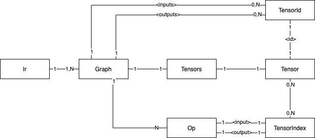

# PopART IR Developer Notes

|  |  |
| ----------- | ----------- |
| **NOTE**:   | These notes are a work in progress, please amend as you see fit. |
|             |             |

The PopART IR is a collection of C++ classes and objects used to represent
models and computational graphs in PopART.

## Entity Relationship Diagram




| Class         | Description                                                                                      |
| ------------- | ------------------------------------------------------------------------------------------------ |
| `Ir`          | The top-level container, comprising at least one main `Graph` and possibly some sub `Graphs`.    |
| `Graph`       | A container for `Ops`.                                                                           |
| `Op`          | A class representing a computational step on tensors. |
| `Tensor`      | A class representing a tensor. |
| `TensorId`    | A class representing tensor names.
| `TensorIndex` | A class representing a mapping from indices to `Tensors`. |
|               |                  |

An IR always has a *main graph*. You can get a reference to the main graph as
follows:
```c++
auto& mainGraph = ir.getMainGraph();
```
You can get other graphs if you know their `GraphId` identifier:
```c++
auto& graph = ir.getGraph(id);                // `id` is a GraphId object.
```

A `Graph` has it's own set of `Tensors`, separate from other `Graphs` in the IR
(see `Graph::getTensors()`). Specific `TensorIds` can be marked as `Graph`,
inputs or outputs. Graph inputs and outputs, unlike `Ops`, are always indexed
contiguously from 0.

Graph inputs and outputs are relevant to those `Ops` that use the `Graph` -- so
called 'subgraph ops' -- like `CallOp`, `IfOp` and `LoopOp`. The `Graphs` used
by an `Op` are referred to as *called graphs* and can be obtained via
`Op::getCalledGraphs()`.

The `Ops` within a graph are connected to each other via tensors. Each `Op` has
specific input and output indices to which a `Tensor` can be connected. These
indices need not (but often do) start from 0 and need not be (but often are)
contiguous. When a `Tensor` is connected to the input index of an `Op` we say
the `Op` *consumes* the tensor. Conversely, when connected to an output index,
we say the `Op` *produces* a tensor. Each `Tensor` can only be produced by one
`Op`. Graph inputs cannot be produced by `Ops`. Each `Tensor` can be consumed
many times (or not at all). `Tensors` are typically connected via these methods:

```c++
auto op = graph.createConnectedOp<FooOp>(...); // Create and connect an Op.
op.connectInTensor(...);                       // Connect input on index.
op.connectOutTensor(...);                      // Connect output on index.
op.createAndConnectOutTensor(...);             // Create and connect output.
```

A `Tensor` being produced by an `Op` A and consumed by `Ops` B, C, D implicitly
introduces a topological constraint that A must be scheduled before B, C and D.
In addition to topological constraints introduced via `Tensor` connections, a
`Graph` can contain additional *topological constraints*. These are simply
additional order constraints that any scheduling of `Ops` must adhere by and
can be managed via the `Graph::topoCons` member, e.g.:

```c++
graph.topoCons->insert(op0, op1);              // Add additional constraint.
```

