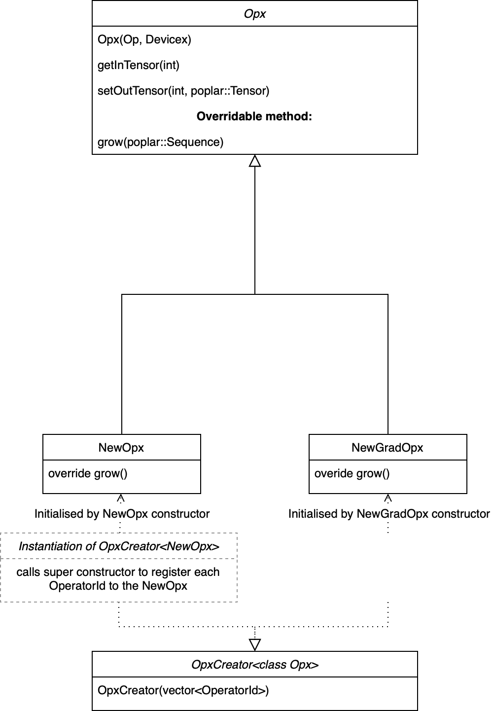

.. _sec_custom_operations:

Custom operators
================

This section explains how to implement a custom operator (op) in PopART. Code
from the `Leaky ReLU custom op example
<https://github.com/graphcore/tutorials/tree/sdk-release-2.6/feature_examples/popart/custom_operators/leaky_relu_example>`_
in the Graphcore GitHub repository will be used to illustrate the concepts.

Overview
--------

To create a custom op in PopART, you need to write (at most) four C++ classes to
implement the op. Each op must have one class (``Op``) which is the PopART
intermediate representation (IR) of the op and one class
(``Opx``) which is the Poplar implementation of the op. ``Op`` is used during
the PopART compilation process to transform and optimise the graph and ``Opx``
provides the code that is run when the graph is executed. Then, if the op will
be used for training, you also need to write two more classes which are the
gradient versions of ``Op`` and ``Opx``.

These classes are compiled to create a shared object library that can be
linked with a Python program when it is run.

You also need to define an "operator identifier". This consists of a unique
combination of domain, operator name and operator version strings. This
is used to register the custom op classes with PopART so that it can be used.

There are two ways of using the new custom op:

* From the **Builder API**: You can include the new op with the builder API using the
  domain, op name and op version that match the custom op definition.

* From an **ONNX file:** You can reference the op from an ONNX file using a
  ``NodeProto`` definition that matches the custom op definition.

The custom op will then be instantiated from the shared object library and
treated like any other op in PopART.

You can also provide an "op definition" when you register the custom op. PopART
will use the definition to check that the correct inputs, outputs and attributes
are provided, and are of the expected types. An example is shown in :numref:`sec_define_op_creator`.

Custom op classes
~~~~~~~~~~~~~~~~~

The two key base classes in PopART that define an op are:

- ``Op``: The IR of an op in PopART. This
  provides methods that are called during the PopART optimisation passes and
  transformations of the compute graph. This representation of the op is
  decoupled from the Poplar implementation.

- ``Opx``: A Poplar implementation of the op. This is the code that will
  actually be run on the IPU. The ``Opx`` class also controls the behaviour of the
  unwinding algorithm, which is how tensor layouts on the IPU are decided.

If the op needs to be differentiable (for training), then ``GradOp`` and
``GradOpx`` classes must also be defined for the gradient operation (see
:numref:`fig_custom_op_OpGradOpOp` and :numref:`fig_custom_op_OpGradOpOpx`).

To make these classes visible to PopART, you must instantiate ``OpCreator`` and
``OpxCreator`` objects. These map from the string identifier of the new op (for
example, "LeakyRelu"; see :numref:`define_op_identifier`) to constructors for
your newly defined ``Op`` and ``Opx`` classes, thus telling PopART how to
lower from the ONNX node to ``Op`` to ``Opx``.

.. figure:: images/custom_op_OpGradOpOp.png
  :align: center
  :width: 50%
  :name: fig_custom_op_OpGradOpOp

  Op class diagram

  Opx class diagram

These classes are compiled to create a shared object library that can be
dynamically linked into a Python program at runtime, as shown below:

.. code-block:: python

  import ctypes

  ctypes.cdll.LoadLibrary(so_path)

You can see how this is done in the `LeakyReLU example
<https://github.com/graphcore/tutorials/tree/sdk-release-2.6/feature_examples/popart/custom_operators/leaky_relu_example/run_leaky_relu.py#L63>`_.

.. _sec_implement_custom_op:

Implementing a custom op
------------------------

Some of the examples in the `GitHub repository
<https://github.com/graphcore/tutorials/tree/master/feature_examples/popart/custom_operators>`__
have a single C++ file that defines all of the classes for a custom op. Although
this can make it easier to see everything in one place, it can be more difficult
to follow. So, in this section the main elements of the ``LeakyRelu`` example
are extracted with detailed descriptions of each method.

.. note:: It is good practice in C++ to put your code inside of a namespace (to avoid conflicts and for hierarchical organisation). However, this should be your own namespace, for example, ``my_custom_op``, and specifically NOT the ``popart`` namespace. Creating an op in the ``popart`` namespace can cause conflicts with members defined inside the PopART code itself.

.. _sec_op_class:

The Op class
~~~~~~~~~~~~

The :cpp:class:`popart::Op` base class provides the methods necessary for the PopART IR passes and transformations.

The main methods that you need to override or implement are:

* Attributes should be passed into the constructor and corresponding accessors
  defined.

* :cpp:func:`~popart::Op::clone`: Returns a clone of the op. Usually, this means
  returning a ``std::make_unique`` copy of the op. This must be implemented.

* :cpp:func:`~popart::Op::setup`: Sets the shape and type of the output tensors
  of the op. This must set the shape and type information for all the output
  :cpp:class:`~popart::TensorInfo` objects. Usually, these are inferred from the
  input tensors. It must be possible to safely call this function multiple times
  on the same op.

* :cpp:func:`~popart::Op::appendAttributes`: Appends attributes when serialising
  the op to a stream. This is used for some debugging purposes but also for
  generating the PopART IR hash. This hash is used to determine whether a Poplar
  cache can be reused so it is important that op attributes which may alter the
  Poplar compilation are appended to this stream. If this method is overridden,
  then it must also call the base class method.

* :cpp:func:`~popart::Op::appendOutlineAttributes`: Determines which ops are
  functionally equivalent during outlining.

* :cpp:func:`~popart::Op::getGradOps`: Returns a vector of grad ops
  for this ``Op`` in the forward graph to automatically generate the backward pass. There can be a
  separate grad op for each input (this is cleaner to implement) or a single grad op that generates gradients for all inputs.

  The mapping from the index of each output tensor of the grad op to the index
  of each input tensor of the non-grad op is configured using the
  :cpp:func:`~popart::Op::gradOutToNonGradIn` method that should be overridden in the grad op classes. The code in :numref:`sec_grad_op_class` shows an example of this.

* :cpp:func:`~popart::Op::getSubgraphValue`: This is used by the outlining
  algorithm to determine whether or not to outline ops. There are high and low
  bounding values retrieved by :cpp:func:`~popart::Op::getHighSubgraphValue()`
  (for expensive ops such as :cpp:class:`~popart::ConvOp`) or
  :cpp:func:`~popart::Op::getLowSubgraphValue` (for inexpensive ops such as
  :cpp:class:`~popart::ReluOp`).

* :cpp:func:`~popart::Op::requiresRandomSeed`: This is set to ``false`` by default. This should be overridden and set to ``true`` if an IPU random seed tensor is required by the op. If so, it will be connected to :cpp:func:`~popart::Op::inTensor` by the IR
  process. The input index will be obtained with :cpp:func:`~popart::Op::getSeedInIndex`.

* :cpp:func:`~popart::Op::inplacePriorityDefault`: If the op can be replaced by an in-place variant of itself, this method should be overridden to return a vector of ``<OperatorIdentifier, float>`` tuples in descending order of preference. For example, the ``LeakyRelu`` implementation for this is:

  .. code-block:: cpp

    return {{Onnx::CustomOperators::LeakyReluInplace, 10}};

* :cpp:func:`~popart::Op::getInplaceVariant`: This is called to instantiate a
  particular in-place variant of the op with a specified
  :cpp:class:`~popart::Op::OperatorIdentifier` from the vector returned by
  :cpp:func:`~popart::Op::inplacePriorityDefault`.

LeakyReluOp example
...................

For the Leaky ReLU example, this is the ``Op`` class, ``LeakyReluOp``.

.. code-block:: cpp

  class LeakyReluOp : public popart::Op {
  public:
    LeakyReluOp(const popart::OperatorIdentifier &_opid, float _alpha,
                const popart::Op::Settings &settings_)
        : popart::Op(_opid, settings_), alpha(_alpha) {}

    std::unique_ptr<Op> clone() const final {
      return std::make_unique<LeakyReluOp>(*this);
    }

    void setup() final { outInfo(0) = inInfo(0); }

    void appendAttributes(popart::OpSerialiserBase &os) const override {
      Op::appendAttributes(os);
      os.appendAttribute("alpha", getAlpha());
    }

    void appendOutlineAttributes(popart::OpSerialiserBase &os) const override {
      Op::appendOutlineAttributes(os);
      os.appendAttribute("alpha", getAlpha());
    }

    std::vector<std::unique_ptr<popart::Op>> getGradOps() {
      std::vector<std::unique_ptr<Op>> upops;
      upops.emplace_back(new LeakyReluGradOp(*this));
      return upops;
    }

    float getSubgraphValue() const final { return getHighSubgraphValue(); }

    bool requiresRandomSeed() const override { return false; }

    // Attributes
    float getAlpha() const { return alpha; }

  private:
    float alpha;
  };

.. _sec_grad_op_class:

The grad op class
~~~~~~~~~~~~~~~~~

This code shows the grad op class for Leaky ReLU, ``LeakyReluGradOp``.

.. code-block:: cpp

  class LeakyReluGradOp : public popart::Op {
  public:
    LeakyReluGradOp::LeakyReluGradOp(const LeakyReluOp &fwdOp)
        : popart::Op(CustomGradOperators::LeakyReluGrad_6, fwdOp.settings),
          alpha(fwdOp.getAlpha()) {}

    std::unique_ptr<popart::Op> clone() const final {
      return std::make_unique<LeakyReluGradOp>(*this);
    }
    void setup() final { outInfo(0) = inInfo(0); };

    const std::vector<popart::GradInOutMapper> &gradInputInfo() const {
      static const std::vector<popart::GradInOutMapper> inInfo = {
          {0, 0, popart::GradOpInType::GradOut},
          {1, 0, popart::GradOpInType::In}};
      return inInfo;
    }

    // The Grad Op has 1 output, which is the gradient of the only input
    const std::map<int, int> &gradOutToNonGradIn() const {
      static const std::map<int, int> outInfo = {{0, 0}};
      return outInfo;
    }

    bool requiresRandomSeed() const override { return false; }

    // an estimate of how valuable sub-graph matching will be
    float getSubgraphValue() const final { return getHighSubgraphValue(); }

    float getAlpha() const { return alpha; }

    // Implementation defined below
    void appendAttributes(popart::OpSerialiserBase &os) const override {
      Op::appendAttributes(os);
      os.appendAttribute("alpha", getAlpha());
    }

    // Implementation defined below
    void appendOutlineAttributes(popart::OpSerialiserBase &os) const override {
      Op::appendOutlineAttributes(os);
      os.appendAttribute("alpha", getAlpha());
    }

  private:
    float alpha;
  };

.. _sec_opx_class:

The Opx class
~~~~~~~~~~~~~

The :cpp:class:`popart::popx::Opx` class provides a
:cpp:func:`~popart::popx::Opx::grow` function that implements the corresponding
``Op`` definition as Poplar or PopLibs calls using the provided
:cpp:class:`poplar::program::Sequence`. Since
:cpp:class:`~popart::popx::OpxCreator` uses a generic constructor, you should
also check that the ``Op`` passed in is of the expected type and matches the
:cpp:class:`popart::OperatorIdentifier`.

.. code-block:: cpp

    class LeakyReluOpx : public popart::popx::Opx {
    public:
      LeakyReluOpx(popart::Op *op, popart::popx::Devicex *devicex)
          : popart::popx::Opx(op, devicex) {
        verifyOp<LeakyReluOp>(
            op, {CustomOperators::LeakyRelu_1, CustomOperators::LeakyRelu_6});
      }

      void grow(poplar::program::Sequence &prog) const final {

        auto op = getOp<LeakyReluOp>();

        poplar::Tensor input = getInTensor(0);

        float alpha = op.getAlpha();

        // x < 0.0f ? alpha * x : x
        auto expression = pe::Select(pe::Mul(pe::Const(alpha), pe::_1), pe::_1,
                                     pe::Lt(pe::_1, pe::Const(0.0f)));

        popops::mapInPlace(graph(), expression, {input}, prog,
                           debugContext("LeakyRelu"), poplar::OptionFlags());

        setOutTensor(0, input);
      }
    };

.. _sec_grad_opx_class:

The grad opx class
~~~~~~~~~~~~~~~~~~

This code shows the grad op class for ``LeakyReluOpx``.

.. code-block:: cpp

  class LeakyReluGradOpx : public popart::popx::Opx {
  public:
    LeakyReluGradOpx(popart::Op *op, popart::popx::Devicex *devicex)
        : popart::popx::Opx(op, devicex) {
      verifyOp<LeakyReluGradOp>(op, {CustomGradOperators::LeakyReluGrad_1,
                                      CustomGradOperators::LeakyReluGrad_6});
    }

    void grow(poplar::program::Sequence &prog) const final {

      auto op = getOp<LeakyReluGradOp>();

      poplar::Tensor grad = getInTensor(0);
      poplar::Tensor input = getInTensor(1);

      float alpha = op.getAlpha();

      // (grad * (x < 0.0f ? alpha : 1))
      pe::Mul expression = pe::Mul(pe::Select(pe::Const(alpha), pe::Const(1.0f),
                                              pe::Lt(pe::_2, pe::Const(0.0f))),
                                    pe::_1);

      auto output =
          popops::map(graph(), expression, {grad, input}, prog,
                      debugContext("LeakyReluGrad"), poplar::OptionFlags());

      setOutTensor(0, output);
    }
  };

.. _sec_making_op_available:

Making the op available to PopART
---------------------------------

After you have written the classes that implement the op, you will need to make
the op available to PopART. This means defining an op identifier and using the
op creator class to register the op with PopART.

.. _define_op_identifier:

Define the op identifier
~~~~~~~~~~~~~~~~~~~~~~~~

The first step is to define an operator identifier,
:cpp:class:`~popart::OperatorIdentifier`, with a domain, op name and op version
so that the op can be be found by the :cpp:func:`popart::Builder::customOp` call in
PopART or by a reference to the op in an ONNX file.

:cpp:class:`~popart::OperatorIdentifier` is a structure with the components ``domain``, ``opName`` and ``opVersion``.

For the ``LeakyRelu`` example, from `leaky_relu_custom_op.cpp
<https://github.com/graphcore/tutorials/tree/sdk-release-2.6/feature_examples/popart/custom_operators/leaky_relu_example/leaky_relu_custom_op.cpp#L13>`__ we have:

.. code-block:: cpp

  namespace CustomOperators {
    const popart::OperatorIdentifier LeakyRelu_1 = {"ai.onnx", "LeakyRelu", 1};
    const popart::OperatorIdentifier LeakyRelu_6 = {"ai.onnx", "LeakyRelu", 6};
  } // namespace CustomOperators

  namespace CustomGradOperators {
    const popart::OperatorIdentifier LeakyReluGrad_1 = {"ai.onnx", "LeakyReluGrad", 1};
    const popart::OperatorIdentifier LeakyReluGrad_6 = {"ai.onnx", "LeakyReluGrad", 6};
  } // namespace CustomGradOperators

The namespaces are not strictly required but are common practice in PopART.

.. note::
  In the example, the ``domain`` is ``ai.onnx`` because we are providing an implementation of the ``LeakyRelu`` op of the ``ai.onnx`` operator set defined by the authors of ONNX. However, if you are creating your own op, the ``domain`` should be your own new domain, not a ``domain`` owned by someone else. It should never be the domain `ai.graphcore` as this is the domain of the non-ONNX ops defined inside PopART (for example, all of the grad ops). Failure to do this can cause conflicts.

.. _sec_define_op_creator:

Define the Op creator
~~~~~~~~~~~~~~~~~~~~~

The op creator registers the the new op with PopART.

The operator identifier and a factory function that generates the new op class
are passed to the constructor of :cpp:class:`~popart::OpCreator` to create a
mapping. When your program loads the shared object library, this ``OpCreator``
is instantiated and registers the new op.

You can also pass in an :cpp:class:`~popart::OpDefinition` object that allows
the ``inputs``, ``outputs`` and ``attributes`` in the op to be checked against those provided in the model implementation.

The grad op class does not have an ``OpCreator`` as it is not lowered from ONNX
into the IR. Instead it is generated internally by PopART when it creates the
backward pass on the IR. Specifically, PopART uses the
:cpp:func:`~popart::Op::getGradOps` function to create the grad ops.

.. code-block:: cpp

  namespace {
  static OpDefinition::DataTypes T = {DataType::FLOAT16, DataType::FLOAT};

  static OpDefinition
      leakyReluOpDef({OpDefinition::Inputs({{"input", T}}),
                      OpDefinition::Outputs({{"output", T}}),
                      OpDefinition::Attributes({{"alpha", {"*"}}})});

  static OpCreator<LeakyReluOp> leakyReluOpCreator(
      popart::OpDefinitions({{Onnx::Operators::LeakyRelu_1, leakyReluOpDef},
                            {Onnx::Operators::LeakyRelu_6, leakyReluOpDef}}),
       {
        float alpha = info.attributes.getAttribute<popart::Attributes::Float>(
            "alpha", 1e-2f);
        // default epsilon is 10**(-2)
        return std::make_unique<LeakyReluOp>(info.opid, alpha, info.settings);
      },
      true);
  } // namespace

.. _sec_define_opx_creator:

Define the Opx creator
~~~~~~~~~~~~~~~~~~~~~~

You register the ``Opx`` class in a similar way to the ``Op`` class. In this
case, a generic constructor of the ``Opx`` is always used and has the form:

.. code-block:: cpp

  Opx(Op *op, Devicex *devicex)

For example:

.. code-block:: cpp

    static popart::popx::OpxCreator<LeakyReluOpx> LeakyReluOpxCreator(
        {CustomOperators::LeakyRelu_1, CustomOperators::LeakyRelu_6});
    static popart::popx::OpxCreator<LeakyReluGradOpx>
        LeakyReluGradOpxCreator({CustomGradOperators::LeakyReluGrad_1,
                                 CustomGradOperators::LeakyReluGrad_6});

.. _sec_onnx_schema:

ONNX schema and shape inference
-------------------------------

To enable ONNX to use the op as part of an ONNX model, you must define a
schema for it. This includes inputs, outputs, domain, and versions.

To register
an ``OpSchema``, you can use the macro ``ONNX_OPERATOR_SCHEMA(name)`` and then
append the various functions in the class. See the ONNX `schema.h
<https://github.com/onnx/onnx/blob/master/onnx/defs/schema.h>`__ file for more
examples.

.. code-block:: cpp

    namespace ONNX {

    void LeakyReluShapeInference(InferenceContext &ctx) {
      propagateShapeAndTypeFromFirstInput(ctx);
    }

    static const char LeakyReluDoc[] = "Performs a leaky ReLU operation on the input.";

    ONNX_OPERATOR_SET_SCHEMA_EX(
        LeakyRelu,
        comAcme,
        "com.acme",
        1,
        false,
        OpSchema()
            .SetDoc(LeakyReluDoc)
            .Input(0, "X", "Input tensor", "T")
            .Output(0, "Y", "Output tensor", "T")
            .TypeConstraint(
                "T",
                {"tensor(float)", "tensor(int32)", "tensor(float16)"},
                "Constrain input and output types to signed numeric tensors.")
            .TypeAndShapeInferenceFunction(LeakyReluShapeInference));

    static bool registerOps() {
      auto &d = ONNX_NAMESPACE::OpSchemaRegistry::DomainToVersionRange::Instance();
      d.AddDomainToVersion("com.acme", 1, 1);

      ONNX_NAMESPACE::RegisterSchema(
          GetOpSchema<ONNX_OPERATOR_SET_SCHEMA_CLASS_NAME(comAcme, 1, LeakyRelu)>());

      return true;
    }

    } // namespace ONNX

In the same namespace you can define the shape inference for the op. This allows
ONNX to infer the shape of the outputs from the shape of the inputs. With simple
operations, such as this example, the output shape is the same as the first
input, so you can use the ONNX function ``propagateShapeAndTypeFromFirstInput``
from `shape_inference.h
<https://github.com/onnx/onnx/blob/master/onnx/defs/shape_inference.h>`_.

`shape_inference.h
<https://github.com/onnx/onnx/blob/master/onnx/defs/shape_inference.h>`_ also contains other methods that are used in ONNX for shape inference. For example, NumPy-style broadcasting and shape from attributes. Defining shape inference is optional, however you may encounter issues with operations later in your model if ONNX is not able to infer the input shape of an operation from earlier inputs.

.. _sec_using_op:

Compiling and using the custom op
---------------------------------

Finally, you can compile the C++ code of your op into a shared library,
dynamically load the library from your Python application, and use
:py:func:`popart.builder.customOp` to create an ONNX node in the model with your
operator identifier. When you compile the model (by creating :py:class:`~popart.TrainingSession` or :py:class:`~popart.InferenceSession`),
PopART will find the ``OpCreator`` and ``OpxCreator`` instances you have dynamically loaded, and use them to create the ``Op`` and ``Opx`` instances you defined.

.. _sec_using_op_compiling_code:

Compiling the code
~~~~~~~~~~~~~~~~~~

The PopART headers are in C++11 so you need to compile with C++11 or newer.

* You must pass ``-DONNX_NAMESPACE=onnx``.

* You need to build a shared library. On ``gcc`` and ``clang`` this is done with ``-shared``.

* You must enable PopART and Poplar so the headers and shared libraries can be found:

  .. code-block:: console
    :name: code-enable-popart-poplar
    :caption: Enable Poplar and PopART

    $ source <poplar_sdk>/poplar/enable.sh
    $ source <poplar_sdk>/popart/enable.sh

* To link against the libraries, you pass ``-l<library-name-without-os-defined-prefix-and-extension>`` to the compiler. For example, ``-lpopart -lpoplar -lpoplin -lpopnn -lpopops -lpoputil -lpoprand``, if you need to use all of those libraries, as the ``LeakyRelu`` example does.

* To define the name of the output file, you pass ``-o <file_name>``, for example ``-o libcustom_op.so``.

  .. note:: On Linux, the convention is to prefix the name with ``lib`` and use the file extension ``.so``.

* It is recommended to use ``-fPIC`` when building a shared library that links PopART.

* You will probably want to pass ``-O3`` to instruct the compiler to optimise the produced code.

Therefore, the final command might be:

.. code-block:: bash

  g++ \
    -std=c++14 \
    -fPIC \
    -O3 \
    -DONNX_NAMESPACE=onnx \
    leaky_relu_custom_op.cpp \
    -shared \
    -lpopart -lpoplar -lpoplin -lpopnn -lpopops -lpoputil -lpoprand \
    -o libleaky_relu_custom_op.so

Alternatively, if you are using CMake to build your custom op, PopART defines a
CMake package, so your op can be found and linked against in the standard CMake way:

.. code-block:: cmake

  # If you want version 2.6 specifically. The `2.6` can be omitted.
  find_package(popart 2.6 REQUIRED)

  # Assuming `leaky_relu_custom_op` is the name of the target for your custom op
  # shared library.
  target_link_libraries(leaky_relu_custom_op PRIVATE popart)

All of the above compiler flags will be automatically handled for you.

As before, PopART must be enabled before configuring the CMake project. Enabling
PopART sets the ``CMAKE_PREFIX_PATH`` environment variable so that ``find_package`` can find the PopART CMake package.

.. _sec_using_op_application:

Using the compiled custom op in an application
~~~~~~~~~~~~~~~~~~~~~~~~~~~~~~~~~~~~~~~~~~~~~~

As with the compilation, Poplar and PopART must also be enabled at runtime (:numref:`code-enable-popart-poplar`), so
the operating system can find the shared libraries of the Poplar SDK.

In your application, the compiled library can be loaded from Python using the ``ctypes`` library:

.. code-block:: python

  import ctypes
  ctypes.cdll.LoadLibrary(so_path) # path to compiled shared library

The op can be referenced, using the values in the ``OpIdentifier`` object, in a Python program using the ``builder``. For example, from `run_leaky_relu.py
<https://github.com/graphcore/tutorials/tree/sdk-release-2.6/feature_examples/popart/custom_operators/leaky_relu_example/run_leaky_relu.py>`_:

.. code-block:: python

  output_tensor = builder.customOp(opName="LeakyRelu",
                                   opVersion=6,
                                   domain="ai.onnx",
                                   inputs=[input_tensor],
                                   attributes={"alpha": alpha})[0]

If you are directly importing an ONNX file with the builder, the op can be
referenced like any other op. This means using a `NodeProto
<https://github.com/onnx/onnx/blob/master/onnx/onnx.proto#L191>`_
definition that matches the domain, name and version of the op.

.. TODO: Do we have an example of this?

If you are using PyTorch you can also call this custom op
:ref:`using PopTorch <poptorch-user-guide:make the op available to pytorch>`.
