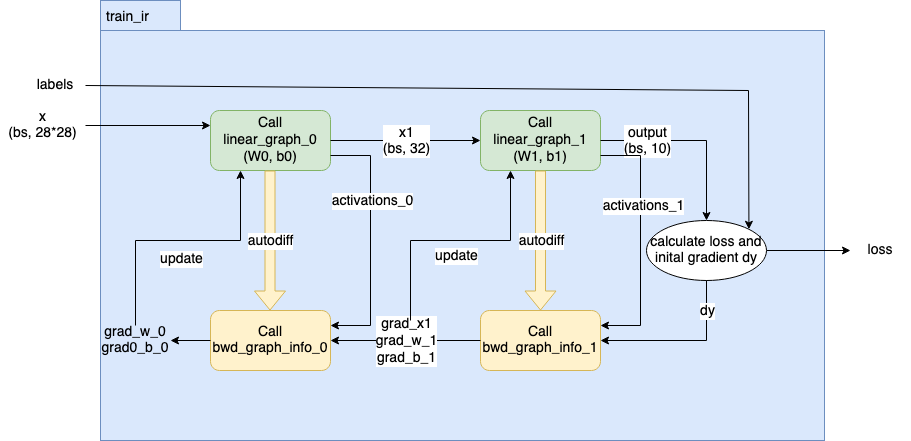

.. _sec_application_example_mnist:

Application example: MNIST
==========================

In this section, you will see how to train a simple machine learning application in PopXL.
The neural network in this example has two linear layers. It will be trained with the
the `MNIST dataset <http://yann.lecun.com/exdb/mnist/>`_. This dataset contains 60,000 training images
and 10,000 testing images. Each input image is a handwritten digit with a resolution of 28x28 pixels.

Import the necessary libraries
------------------------------
First, you need to import all the required libraries.

.. literalinclude:: files/mnist.py
  :language: python
  :start-after: import begin
  :end-before: import end
  :linenos:
  :lineno-match:

Prepare dataset
---------------
You can get the MNIST training and validation dataset using `torch.utils.data.DataLoader <https://pytorch.org/docs/stable/data.html#torch.utils.data.DataLoader>`_.

.. literalinclude:: files/mnist.py
  :language: python
  :start-after: dataset begin
  :end-before: dataset end
  :linenos:
  :lineno-match:

Create IR for training
----------------------
The training IR is created in ``build_train_ir``. After creating an instance of IR, operations are added
to the IR within the context of its main graph. These operations are also forced to execute in the same
order as they are added by using context manager :py:func:~popxl.in_sequence`.

.. literalinclude:: files/mnist.py
  :language: python
  :start-after: create ir begin
  :end-before: create ir end
  :linenos:
  :lineno-match:

The initial operation is to load input images and labels to ``x`` and ``labels``, respectively
from host-to-device streams ``img_stream`` and ``label_stream``.

.. literalinclude:: files/mnist.py
  :language: python
  :start-after: h2d begin
  :end-before: h2d end
  :linenos:
  :lineno-match:

After the data is loaded from host, you can build the network, calculate the loss and gradients,
and finally update the weights. This process is shown in :numref:`fig_popxl_mnist` and will be
detailed in later sections.

  Overview of how to build a training IR in PopXL

To monitor the training process, you can also stream the loss from the IPU devices to the host.

.. literalinclude:: files/mnist.py
  :language: python
  :start-after: out begin
  :end-before: out end
  :linenos:
  :lineno-match:

Create network
~~~~~~~~~~~~~~

The network has 2 linear layers. A linear layer is defined by the class ``Linear`` that
inherits from ``popxl.Module``. We are here overriding the ``build`` method which builds the
subgraph to do the linear computation.

.. literalinclude:: files/mnist.py
  :language: python
  :start-after: linear begin
  :end-before: linear end
  :linenos:
  :lineno-match:

In the diagram :numref:`fig_popxl_mnist`, you can see two graphs created from the two linear
layers by using :py:func:`popxl.Ir.create_graph` and called by using :py:func:`popxl.call_with_info`.
The tensors ``x1`` and ``y`` are respectively the outputs of the first linear graph call and the
second linear graph. The weight tensors, bias tensors, output tensors, graphs, and graph callsite
infos are all returned for the next step. This forward graph of the network is created in the method
``create_network_fwd_graph``.

.. literalinclude:: files/mnist.py
  :language: python
  :start-after: network begin
  :end-before: network end
  :linenos:
  :lineno-match:

.. _sec_grad_example_mnist:

Calculate gradients and update weights
~~~~~~~~~~~~~~~~~~~~~~~~~~~~~~~~~~~~~~

After creating the forward pass in the training IR, we will calculate the gradients in ``calculate_grads``
and update the weights and bias in ``update_weights_bias``.

* Calculate ``loss`` and initial gradients ``dy`` by using :py:func:`~popxl.ops.nll_loss_with_softmax_grad()`.

  .. literalinclude:: files/mnist.py
    :language: python
    :start-after: loss begin
    :end-before: loss end
    :linenos:
    :lineno-match:

* Construct the graph to calculate the gradients for each layer, ``bwd_graph_info_0`` and ``bwd_graph_info_1``
  by using :py:func:~popxl.transforms.autodiff` (:numref:`sec_autodiff`) transformation on its forward pass graph.
  Note that, you only need to calculate the gradients for ``W0`` and ``b0`` in the first layer, and gradients for
  all the inputs, ``x1``, ``W1`` and ``b1``, in the second layer. In this example, you will see two different ways
  to use ``autodiff`` and how to use it to get the required gradients.

  Let's start fromt the second layer.
  The ``bwd_graph_info_1``, returned from ``autodiff`` of the second layer, contains the graph to calculate the
  gradient for the layer. The activations for this layer ``activations_1`` is obtained from the corresponding
  forward graph call. After calling the gradient graph, ``bwd_graph_info_1.graph`` with ``popxl.ops.call_with_info``,
  the ``grads_1_call_info`` is used to get all the gradients with regard to the inputs ``x1``, ``W1``, and ``b1``.
  The method ``fwd_parent_ins_to_grad_parent_outs`` gives a mapping from the corresponding forward graph inputs,
  ``x1``, ``W1``, and ``b1``, and their gradients, ``grad_x1``, ``grad_w_1``, and ``grad_b_1``.
  The input gradient for ``grads_1_call_info`` is ``dy``.

  .. literalinclude:: files/mnist.py
    :language: python
    :start-after: grad_1 begin
    :end-before: grad_1 end
    :linenos:
    :lineno-match:

  For the first layer, we can obtain the required gradients in a similar way. Here we will show you an alternative
  approach. We define the list of tensors that require gradients ``grads_required=[linears[0].W, linears[0].b]``
  in ``autodiff``. Their gradients are returned directly from the ``popxl.ops.call`` of the gradient graph ``bwd_graph_info_0.graph``.
  The input gradient for ``grads_0_call_infof`` is the gradients w.r.t the input of the second linear graph,
  the output of the first linear graph, ``grad_x_1``.

  .. literalinclude:: files/mnist.py
    :language: python
    :start-after: grad_0 begin
    :end-before: grad_0 end
    :linenos:
    :lineno-match:

* Update the weights and bias tensors with SGD by using :py:func:`~popxl.ops.scaled_add_()`.

  .. literalinclude:: files/mnist.py
    :language: python
    :start-after: update begin
    :end-before: update end
    :linenos:
    :lineno-match:

Run the IR to train the model
-----------------------------
After an IR is built taking into account the  batch size ``args.batch_size``, we can run it repeatedly until the end of the required
number of epochs. Each session is initiated by one IR as shown in the following code:

.. literalinclude:: files/mnist.py
  :language: python
  :start-after: session begin
  :end-before: session end
  :linenos:
  :lineno-match:

The session is run for ``nb_batches`` times for each epoch. Each ``train_session`` run consumes a batch of input images
and labels, and produces their loss values to the host.

.. literalinclude:: files/mnist.py
  :language: python
  :start-after: train begin
  :end-before: train end
  :linenos:
  :lineno-match:

After the training session finishes running, the trained tensor values, in a mapping from tensors to their values ``trained_weights_data_dict``,
are obtained by using ``train_session.get_tensors_data``.

Create an IR for testing and run the IR to test the model
---------------------------------------------------------
For testing the trained tensors, you need to create an IR for testing, ``test_ir``, and its corresponding session,
``test_session`` to run the test. The method ``write_variables_data`` is used to copy the trained values from
``trained_weights_data_dict`` to the corresponding tensors in test IR, ``test_variables``.

.. literalinclude:: files/mnist.py
  :language: python
  :start-after: test begin
  :end-before: test end
  :linenos:
  :lineno-match:
