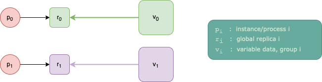
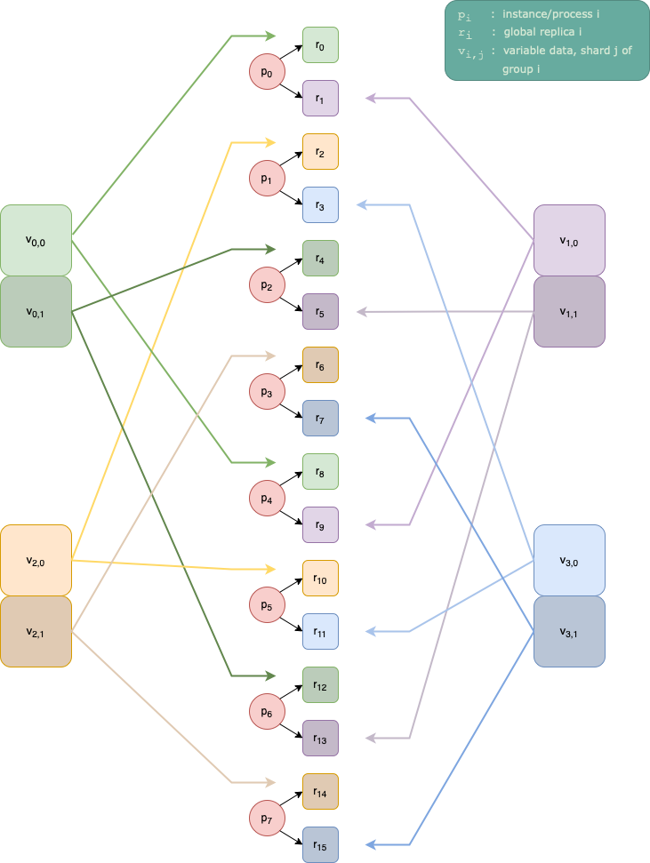

.. _ch_distributed:

Distributed PopXL Instances
===========================

.. _sec_distributed_intro:

Introduction
------------

PopXL and the underlying Poplar SDK software stack are designed to help you
run multiple instances of your single PopXL program in an SPMD (single program,
multiple data) manner, for example with MPI. Combined with graph replication
(see :numref:`sec_replication_types`), each instance will have a "local"
replication factor, and overall there will be a "global" replication factor. For
example, you may wish to run your model in data-parallel across 16 replicas and
4 host instances. This means each instance will have a local replication factor
of 4, and the global replication factor is 16. Global replication with no local
replication is also possible. Each instance can only directly communicate with
the replicas assigned to it, but is aware of the global situation (for example
that it covers replicas 4...7 in a 4-instance program of 16 replicas total).

The reasons you may wish to distribute your replicas over multiple
host instances include:
  * To increase the potential bandwidth between host and IPU, by locating your
    instances on separate physical hosts (as each will have its own links to its
    IPUs).
  * You *must* have at least one process per :term:`glossary:ILD` when using a 
    partition of IPUs that spans multiple ILDs. Please see
    :ref:`here <vipu-admin:ipu-link domains>`
    and :ref:`here <vipu-admin:cluster topologies>`
    for more information on ILDs.

This concept is referred to as "multiple instances", "multiple processes",
"multiple hosts", "distributed instances", "distributed replicated graphs",
and other similar terms.

Primer on using PopDist and PopRun to run multi-instance applications
-------------------------------------------------------------------------

You can use PopRun and PopDist to run multiple instances of your program using
MPI. We will give a brief introduction here, but the
:doc:`poprun-user-guide:index` contains more information.

PopDist provides a :ref:`Python library <poprun-user-guide:popdist_python_api>`
that will help you set up a PopXL program to be run on multiple instances.
Specifically, it will set metadata about the multi-instance environment (like
global replication factor and which replicas are on the instance) in the session
options, and will select a suitable device for the instance. PopDist gets this
information from environment variables that are set for each process.

PopRun is a command-line interface that wraps your application command-line, and
to which you pass options configuring the multi-instance setup, for example
the number of instances, the hosts to spread the instances across, and the
global replication factor. It can optionally create an appropriate
:ref:`V-IPU partition <vipu-user:partitions>` for you with the correct number of
:term:`GCDs <glossary:GCD>`, devices, and so on, for running a Poplar program
according to the multi-instance configuration you specified. It will then use
MPI to run the command-line you passed according to this configuration. It can
assign instances to the hosts in a NUMA-aware manner. The environment variables
read by PopDist will be set appropriately in each instance for you. This enables
PopDist to setup your PopXL program correctly on each instance.

Basic Example
-------------

This example shows how to configure a program to run on multiple instances using
PopDist and PopRun.

Assume you have the following program ``model.py``:

.. code-block:: python
  :emphasize-lines: 2

  import popxl
  ir = popxl.Ir()
  with ir.main_graph:
    v = popxl.variable(1)
    w = popxl.variable(2)
    v += w
  with popxl.Session(ir, 'ipu_hw') as sess:
    sess.run()
    print(sess.get_tensor_data(v))

To configure this program for multiple instances using PopDist, you only need to
change the ``Ir``-construction line to ``popxl.Ir(replication='popdist')``.
This will tell PopXL to use PopDist for configuring the session options and
selecting the device.

The following ``poprun`` command runs your program ``model.py`` on 2 instances
(``--num_instances``) with 2 global replicas (``--num_replicas``). This gives
1 replica per instance. It also creates an appropriate partition for you called
``popxl_test`` (``--vipu-partition popxl_test --update-partition yes``):

.. code-block:: bash

  poprun \
    --vipu-partition popxl_test --update-partition yes \
    --num-replicas 2 --num-instances 2 \
    python model.py

If you pass ``--print-topology yes``, PopRun will print a diagram visualising the
topology it has created for you::
   ===================
  |  poprun topology  |
  |===================|
  | hosts     |  [0]  |
  |-----------|-------|
  | ILDs      |   0   |
  |-----------|-------|
  | instances | 0 | 1 |
  |-----------|-------|
  | replicas  | 0 | 1 |
   -------------------

In a more realistic example, you would be doing something like data-parallel
training over all of the *global* replicas. On each instance, the user would
manage sending the right sub-batches of data to each instance in
:py:meth:`popxl.Session.run`. The optimiser step would perform an
:py:func:`popxl.ops.replicated_all_reduce` on the gradient tensor before
applying the optimiser step. The AllReduce will automatically happen across all
the replicas *across all the instances* in an efficient way given the network
topology between the replicas.

Variable ReplicaGroupings and multiple instances
------------------------------------------------

.. note::
  This section assumes you are familiar with using a
  :py:class:`~popxl.ReplicaGrouping` to control how a variable is initialised
  across replicas in PopXL. See :numref:`sec_replica_grouping` for more details.

The replica grouping is defined across the global replicas, not locally on each
instance. This means that, in a multi-instance program, the default replica
grouping of a single group containing all replicas is all of the replicas across
all of the instances. This is what happened in the above example (it did not
pass a replica grouping to ``popxl.variable`` so used the default): there was 1
group containing 2 replicas, and each instance had one of those replicas.

Therefore, groups can span across instances.

:numref:`fig-multi_instance_vs_simple_example` shows a scenario for 2 instances
a global replication factor of 2, and
``ReplicaGrouping(group_size=1, stride=1)``.

  The assignment of the replicas to instances, and the variable data from the
  host to each replica. This for 2 instances, 2 replicas, and
  ``ReplicaGrouping(group_size=1, stride=1)``.

As the variable has multiple groups, you must pass one set of host tensor data
for each group. For a variable with shape ``shape`` and ``N`` groups
(``N > 1``), this is done by passing host data of shape ``(N, *shape)``. In the
example, there are 2 groups, so the host data you pass must have an extra
dimension at the front of size 2.

For each replica, PopXL will send the data for that replica's group to that
replica. This happens as per usual in
:py:meth:`popxl.Session.weights_from_host`. In the above example,
``weights_from_host`` is called implicitly when entering the ``Session``
context. See :numref:`sec_session` if you are unfamiliar with this.

Specifically, instance 0 will send ``w_data[0]`` to global replica 0 (which is
local replica 0 on that instance); and instance 1 will send ``w_data[1]`` to
global replica 1 (which is local replica 0 on that instance).

The code for such a program is shown in :numref:`distributed_simple_example`.

.. literalinclude:: files/distributed_simple_example.py
  :language: python
  :name: distributed_simple_example
  :caption: Simple distributed example.
  :linenos:
  :lineno-match:
  :start-after: Code Begin
  :end-before: Code End

.. only:: html

    :download:`Download distributed_simple_example.py <files/distributed_simple_example.py>`

You can print ``session.get_tensor_data(v)`` and see that every instance now
has the full globally updated weight tensor. This is because, in
:py:meth:`popxl.Session.weights_to_host` (called implicitly on context exit in
the above code), each instance will get their updated weight slices from their
local replicas, then communicate the data between them so all instances have all
the updated data.

The program above is what each instance executes in an SPMD paradigm (using
MPI, if using PopRun). However, the code is aware of the full global picture.
That is, each instance running the code is passing a replica grouping defined
over the *global* replica space; each passes the full global ``v_data`` even
though some of the data will not belong to the replicas of that instance; and
each returns the full global data in ``session.get_tensor_data(v)``.

Detail of inter-instance communication
~~~~~~~~~~~~~~~~~~~~~~~~~~~~~~~~~~~~~~

In ``weights_to_host``, each instance will send the data from each local replica
to the same corresponding slice in the weight's data buffer. We are using the
default ``one_per_group`` variable retrieval mode, so we only send data from the
first replica in each group back to host (see parameter ``retrieval_mode`` of
:py:func:`popxl.variable`).

At this point, each instance has updated the slices of the host weight buffer
only for the groups whose first replica resided on that instance. Thus, the
instances need to communicate with each other to recover the fully updated
weight tensor.

Let us examine the example in :numref:`distributed_simple_example`. There are 2
groups. The first replica of group 0 is global replica 0, which is local replica
0 on instance 0. Therefore, instance 0 will fetch the updated ``v`` data from
that replica and write it to the internal host buffer for group 0 of ``v``.

The first replica of group 1 is global replica 1, which is local replica 0 on
instance 1. Therefore, instance 1 will fetch the updated ``v`` data from that
replica and write it to the internal host buffer for group 1 of ``v``.

At this point, instance 0 has only updated the data for group 0 locally, and
instance 1 has only updated the data for group 1 locally. The instances will
therefore communicate between themselves so that all instances have all the
updated data. PopXL does all of this automatically.

Say we had used variable retrieval mode ``all_replicas`` (see parameter
``retrieval_mode`` of :py:func:`popxl.variable`). The host buffer would
hold one weight tensor value per global replica, but each instance will have
only updated it for the replicas that reside on that instance. As with the above
case, the instances will automatically communicate to recover the full weight
tensor.

Internally, PopXL uses MPI for performing the inter-instance communication, and
will automatically initialise an MPI environment for you.

Sharding and multiple instances
-------------------------------

.. note::
  This section assumes you are familiar with replicated tensor sharding (RTS) in
  PopXL. See :numref:`sec_rts` for more information.

Sharding is supported on multiple instances using the same APIs as for single
instance programs.

Basic Example
~~~~~~~~~~~~~

Like with replica groupings, the sharding is defined over the global replicas.

Going back to the example of 2 instances, 2 global replicas, and 1 group of
size 2. The default sharding (which is to shard across every replica in the
group) would result in the first shard of the weight data going to the first
global replica, and the second shard going to the second global replica.
As replica 0 is on instance 0, instance 0 will send the corresponding shard to
that replica. Similarly for replica 1 and instance 1. In ``weights_to_host``,
the instances will each retrieve the shard from their local replica, then
communicate with the other instance to reconstruct the full updated weight
tensor on that instance.

Such a program is shown in :numref:`distributed_rts_simple_example`.

.. literalinclude:: files/distributed_rts_simple_example.py
  :language: python
  :name: distributed_rts_simple_example
  :caption: Simple distributed RTS example.
  :linenos:
  :lineno-match:
  :start-after: Code Begin
  :end-before: Code End

.. only:: html

    :download:`Download distributed_rts_simple_example.py <files/distributed_rts_simple_example.py>`

Note we do not need to explicitly pass the ``replica_grouping`` or
``shard_over`` parameters to ``popxl.replica_sharded_variable`` as we are using
the default settings of 1 group and sharding across every member of that group.

As before, each instance passes the full global tensor data to PopXL, and the
full global data is returned.

:numref:`distributed_rts_simple_example_manual_remote_buffer` shows the same
example, but instead of using ``popxl.replica_sharded_variable``,
we manually create a remote buffer and manually load from and store to it. If
you are unfamiliar with the RTS API, please refer to :numref:`sec_rts`.

.. literalinclude:: files/distributed_rts_simple_example_manual_remote_buffer.py
  :language: python
  :name: distributed_rts_simple_example_manual_remote_buffer
  :caption: Simple distributed RTS example with manual control of the remote buffer.
  :linenos:
  :emphasize-lines: 3-5,20
  :start-after: Code Begin
  :end-before: Code End

.. only:: html

    :download:`Download distributed_rts_simple_example_manual_remote_buffer.py <files/distributed_rts_simple_example_manual_remote_buffer.py>`

We have replaced one call to ``popxl.replica_sharded_variable`` with
``popxl.replica_sharded_buffer`` to create a remote buffer with a tensor shape
equivalent to the shape of one shard; ``popxl.remote_replica_sharded_variable``
to create the remote variable handle; and ``ops.remote_load`` /
``ops.remote_store`` to load/store the shard from the remote buffer.

Note, we pass the full global unsharded shape to
``popxl.replica_sharded_buffer``.

Using shard_over
~~~~~~~~~~~~~~~~

You can use the ``shard_over`` parameter to specify the number of replicas in a
group that the weight is sharded over (see
:py:func:`popxl.replica_sharded_buffer` or
:py:func:`popxl.replica_sharded_variable`). The weight will be repeatedly
sharded over every ``shard_over`` consecutive replicas of the group.
For example, for ``w = [1, 2]``, 4 replicas in the group, and ``shard_over=2``,
the replicas will get the values::
  Replica 0: [1]
  Replica 1: [2]
  Replica 2: [1]
  Replica 3: [2]

The same thing happens when this is a multi-instance program and these are the
global replicas spread across instances. For example, if there were 2 instances,
replicas 0 and 1 would be on instance 0, and replicas 2 and 3 would be on
instance 1. Each instance would send the correct slices of the weight data to
each of its local replicas based on the replica grouping and sharding settings.

Complex Example
~~~~~~~~~~~~~~~

Let us now consider a more complex example, with 8 instances, 16 global
replicas, ``ReplicaGrouping(group_size=4, stride=4)``, and ``shard_over=2``.
This is shown in :numref:`fig-multi_instance_vs_rts_complex_example`.

  The assignment of the replicas to instances, and of the variable data from the
  host to each replica. This for 8 instances, 16 replicas,
  ``ReplicaGrouping(group_size=4, stride=4)`` and ``shard_over=2``.

We will write a rather contrived, arbitrary program as a minimal example of
using such settings. The program creates the variable with these settings,
AllGathers the shards, performs an inplace element-wise addition, scatters the
result across replicas, and updates the shards to be those values. This
program is shown in :numref:`distributed_rts_complex_example`.

.. literalinclude:: files/distributed_rts_complex_example.py
  :language: python
  :name: distributed_rts_complex_example
  :caption: Distributed RTS example with ``ReplicaGrouping(group_size=4, stride=4)`` and ``shard_over=2``.
  :linenos:
  :emphasize-lines: 18-21,25
  :start-after: Code Begin
  :end-before: Code End

.. only:: html

    :download:`Download distributed_rts_complex_example.py <files/distributed_rts_complex_example.py>`

To run this program on 16 replicas and 8 instances using PopRun:

.. code-block:: bash
  
  poprun \
    --vipu-partition popxl_test --update-partition yes \
    --num-replicas 16 --num-instances 8 \
    python model.py

Note, when we create the variable, we describe what replicas will get what
data through a combination of both ``replica_grouping`` and ``shard_over``. We
think of it as 4 groups each repeatedly sharding their value over every 2
replicas in that group. However, when we perform the collective and pass a
replica grouping to describe what combinations of replicas should gather with
each other, there is only the one ``replica_grouping`` parameter and we have to
construct the appropriate grouping for gathering the shards manually. The
grouping we need is the original grouping, but with the ``group_size`` divided
by the ``shard_over``. This is done in the highlighted lines of the example.

The reason the API is like this is because, conceptually, the APIs for
describing how to initialise a variable across replicas and which replicas
collectives should be performed across have no bearing on each other, they just
both happen to use replica groupings for describing groups of replicas.

.. warning::
  However, when AllGather-ing a **sharded** tensor, the replica grouping that is
  *exactly* the grouping used to initialise the variable with the group size
  divided by the shard over, is **the only replica grouping that is valid**.
  This is because the data for the shards you are gathering comes from the
  variable's host data, and this data was CBR-rearranged *before* being split
  into shards and uploaded to each device. Therefore, unless the sharding
  configuration of the variable and the replica grouping of the AllGather are
  exactly semantically equivalent, the AllGather will not know how to undo the
  CBR-rearragement on its output tensor. If you attempt to pass any other
  replica grouping, it is undefined behaviour.

  For any replicated collective other than AllGather, or if the input tensor of
  the AllGather is not a *sharded* tensor, you can pass any replica grouping you
  want, even if the input tensor is a variable that was initialised using a
  different replica grouping.
