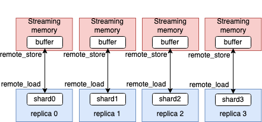

.. _sec_remote:

Variables in Streaming Memory
=============================

When the IPU memory is insufficient, you can use :ref:`poplar-user-guide:remote memory buffers`
to store and load data in Streaming Memory. The remote buffer is often used
for the variable tensors and intermediate tensors. In this section, you will
see how to use the following in PopXL:

- remote buffers
- remote variables
- replicated tensor sharding variables

Remote buffers
-------------

In PopXL, you can create a remote buffer in the IR by using
:py:func:`remote_buffer(tensor_shape, tensor_dtype, entries) <popxl.remote_buffer>`. The remote buffer
contains ``entries`` number of slots for tensors with the same ``tensor_shape``
and ``tensor_dtype``.

You can then store a tensor ``t`` at the index ``offset`` of a remote
buffer ``remote_buffer`` by using the operation :py:func:`remote_store(remote_buffer, offset, t) <popxl.ops.remote_store>`.
To load a tensor at the index ``offset`` of the remote buffer ``remote_buffer``,
you can use :py:func:`remote_load(remote_buffer, offset, name) <popxl.ops.remote_load>`.
You can also give a ``name`` to the returned tensor.

Remote variables
---------------

Similarly to creating a variable (:numref:`sec_variable`), you can also create
a variable located in Streaming Memory by using:

.. code-block:: python

    remote_variable(data: Union[HostTensor, float, int],
                    remote_buffer: RemoteBuffer,
                    offset: int = 0,
                    dtype: Optional[dtypes.dtype] = None,
                    name: Optional[str] = None,
                    downcast: bool = True)

The returned variable, with ``data`` as its value, is put at the index ``offset`` of the
``remote_buffer``. The data type and shape of this variable need to be compatible
with the remote buffer's.

:numref:`code_remote_variable_popxl` shows how to use remote buffers and remote variables.
First, a remote buffer, ``buffer``, is created with only 1 entry. Then a remote variable,
``remote_x``, is created with value 1. This variable is stored at the index 0 of the ``buffer``.
The value is then loaded from remote buffer to IPU variable ``loaded_x``. The value
of ``loaded_x`` is then updated by ``y`` with value 2. The new value of ``loaded_x``
is then stored to the same place, index 0 of ``buffer``, as ``remote_x``. You can
check the value of ``remote_x`` by using ``session.get_tensor_data(remote_x)`` after
you run a ``session``. Both the ``loaded_x`` and ``remote_x`` have the value 3 in this
example.

.. literalinclude:: files/remote_variable.py
  :language: python
  :name: code_remote_variable_popxl
  :caption: Example to use remote buffer and remtoe variable
  :start-after: remote_var begin
  :end-before: remote_var end

.. only:: html

    :download:`Download remote_variable.py <files/remote_variable.py>`

.. _sec_rts:

Replicated tensor sharding variables
-----------------------------------

You can also create You can also create a replicated tensor sharding (RTS) variable that is
scattered in equal shards across replicas. See the :ref:`PopART User Guide <popart-user-guide:replicated tensor sharding (rts)>`
for more information. Together with the AllGather
operation :py:func:`~popxl.ops.collectives.replicated_all_gather()`, it avoids storing the same tensor
for each replica. The full tensor is stored in Streaming Memory. After the full tensor is
updated on the IPU, it needs to be sharded and/or reduced again to each replica by using
the ReduceScatter operation :py:func:`~popxl.ops.collectives.replicated_reduce_scatter()`.

In PopXL, each shard of an RTS variable is stored in its own remote buffer. To simplify
the use of replication, each shard shares the same representation of its remote buffer.
As shown in the following diagram, each buffer has the same tensor type and tensor
shape in each shard. The number of shards is the same as the number of replicas.

  An RTS variable in PopXL

Note that, you need to have replication enabled to create an RTS variable.

There are two ways to create an RTS variable:

#. Store the full variable in Streaming Memory. You can access the variable through ``remote_buffer``.

   .. code-block:: python

    remote_replica_sharded_variable(data: Union[HostTensor, float, int],
                                    remote_buffer: RemoteBuffer,
                                    offset: int = 0,
                                    dtype: Optional[dtypes.dtype] = None,
                                    name: Optional[str] = None,
                                    downcast: bool = True) -> Variable

   It will return an RTS variable that has value ``data``
   at the index ``offset`` of ``remote_buffer``. You need to use ``remote_load`` and
   ``remote_store`` operations to load and store the variable data to and from the IPU.

#. Store the full variable in Streaming Memory, along with a tensor to represent its shards.
   The tensor representing the shards can be used without ``remote_load`` and ``remote_store``
   since it has already been loaded from or stored to Streaming Memory automatically.

    .. code-block:: python

        replica_sharded_variable(data: Union[HostTensor, float, int],
                                 dtype: Optional[dtypes.dtype] = None,
                                 name: Optional[str] = None,
                                 downcast: bool = True) -> Tuple[Variable, Tensor]

   In this case, the variable is still created with a remote buffer in the implementation
   like in the ``remote_replica_sharded_variable``. The number of entries in this buffer is
   the number of elements in the data divided by the number of replicas. Each shard is then
   automatically loaded or stored according to the execution context. However, the remote
   buffer part is hidden to provide an easier interface. You can use ``remote_replica_sharded_variable``
   to have better flexibility.

:numref:`code_remote_rts_variable_popxl` in the code tab `Remote RTS variable` below
shows how to update the value of a remote RTS variable created by ``remote_replica_sharded_variable``.

   * The remote RTS variable ``remote_x`` is created with a remote buffer ``buffer``
     using ``remote_replica_sharded_variable``.
   * Remote load ``remote_x`` to tensor ``loaded_x``.
   * Gather the shards of the tensor ``loaded_x`` to ``full_x``.
   * Update the tensor ``full_x`` in place by adding ``y``.
   * Scatter tensor ``full_x`` across replicas to ``updated_shard``.
   * Remote store tensor ``updated_shard`` to index 0, the same place as ``remote_x``, in ``buffer``.

:numref:`code_rts_variable_popxl` in the code tab `RTS variable` below shows how to
update the RTS variable created by ``replica_sharded_variable``. In this example you
can see the burden of remote store and load are hidden.

   * A remote RTS variable ``remote_x`` and its shards ``loaded_x`` are created by
     using ``replica_sharded_variable`` without specifying a buffer.
   * Then shards ``loaded_x`` are updated by adding the sharded ``y``.

.. tabs::

   .. group-tab:: **Remote RTS variable**

      .. literalinclude:: files/remote_rts_var.py
         :language: python
         :name: code_remote_rts_variable_popxl
         :caption: Example to use remote RTS variable
         :start-after: remote_var begin
         :end-before: remote_var end

      .. only:: html

         :download:`Download remote_rts_var.py <files/remote_rts_var.py>`

   .. group-tab:: **RTS variable**

      .. literalinclude:: files/rts_var.py
         :language: python
         :name: code_rts_variable_popxl
         :caption: Example to use RTS variable
         :start-after: remote_var begin
         :end-before: remote_var end

      .. only:: html

         :download:`Download rts_var.py <files/rts_var.py>`
