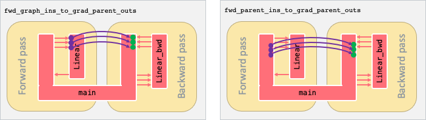

.. _sec_transforms:

Transforms
==========

After an IR is built, you can use transforms or patterns to
manipulate its graphs in a non-trivial way.
Transforms are used to change a graph at the graph level, while
patterns are usually used to change a specific operation repeatedly
in a graph.

..  Applying transforms
  ^^^^^^^^^^^^^^^^^^^

  - Explain what transforms are available and how you use them.

Currently, we support the following transforms:

  -  Autodiff

..  -  Merge exchange

.. _sec_autodiff:

Autodiff
-----------

In PopXL you can use :py:func:`~popxl.transforms.autodiff` to perform automatic differentiation on a per-graph basis. This transform creates a graph (the *gradient graph*) to compute
the gradients of a forward graph. It is declared as:

.. code-block:: python

  autodiff(graph: Graph,
            grads_provided: Optional[Iterable[Tensor]] = None,
            grads_required: Optional[Iterable[Tensor]] = None,
            called_graphs_grad_info: Optional[Mapping[Graph, GradGraphInfo]] = None,
            return_all_grad_graphs: bool = False)

The inputs are as follows:

* ``graph`` is a forward graph.
* ``grads_provided`` indicates for which outputs of ``graph`` we have gradients
  available for ``autodiff`` to use. For instance, if ``graph`` outputs both
  loss and accuracy, you might not want to provide gradients for accuracy. The
  default is that gradients are provided for all of the outputs of the forward
  graph.
* ``grads_required`` indicates which inputs of the forward graph you want
  ``autodiff`` to calculate gradients for. The default is that gradients are
  required for all of the inputs to the forward graph.
* ``called_graphs_grad_info`` and ``return_all_grad_graphs`` can be used to
  reduce computation of gradients when there are subgraphs that are called by
  multiple parent graphs.

  * ``return_all_grad_graphs`` indicates whether to return the gradient graphs
    for all the graphs that ``autodiff`` has been recursively applied to or
    just for the given ``graph``. ``autodiff`` returns an
    :py:class:`~popxl.transforms.GradGraphInfo` object that includes the
    computational graph for computing the gradients if
    ``return_all_grad_graphs`` is set to ``False``. It will return all the
    gradient graphs if ``return_all_grad_graphs`` is set to ``True``.

    * You only need ``return_all_grad_graphs`` if and only if:

      * the graph you are applying ``autodiff`` to has calls to other subgraphs and
      * you need the gradients for those called subgraphs. This typically only happens when you want to apply ``autodiff`` to another graph that also calls these same subgraphs.

      For example, for graphs ``A``, ``B`` and  ``C``, where:

      * ``A`` calls ``C``
      * ``B`` calls ``C``

      If you apply ``autodiff`` to ``B`` first and if you do not specify ``return_all_grad_graph``, then you only get the gradient graph information for ``B``, and not for ``C``. If you specify ``return_all_grad_graphs``, then you will get the gradient graph information for both ``B`` and ``C``. Then, if you want to apply ``autodiff`` to ``A``, which also calls ``C``, you can reuse this gradient graph information for ``C``. This means that ``autodiff`` will not have to create another gradient graph for ``C``.

  * You use ``called_graphs_grad_info`` to provide the information for gradient graphs, which you have already calculated, as inputs to subsequent ``autodiff`` calls where that gradient graph information is needed.

The :py:class:`~popxl.transforms.GradGraphInfo` object contains all the information and tools you need to get a gradient graph:

 -  ``graph``: the associated gradient graph as produced by ``autodiff``
 -  ``forward_graph``: the forward graph that ``autodiff`` was applied to
 -  ``expected_inputs``: the tensors from ``forward_graph`` that are required as inputs to the gradient graph.
 -  ``expected_outputs``: the tensors from the forward graph that have gradients as outputs of the gradient ``graph``.
 -  ``inputs_dict(fwd_call_info)``: the inputs to call the gradient graph.
 -  ``fwd_graph_ins_to_grad_parent_outs(grad_call_info)``: the mapping between forward subgraph tensors and gradient call site tensors. Note that ``grad_call_info`` is the call site information of the gradient gradient graph (:numref:`fig-fwd_graph_ins_vs_fwd_parent_ins`).
 -  ``fwd_parent_ins_to_grad_parent_outs(fwd_call_info, grad_call_info)``: the mapping between forward call site inputs and gradient call site outputs. It can be used to get the gradient with respect to a specific input (:numref:`fig-fwd_graph_ins_vs_fwd_parent_ins`).

   The difference between the mappings returned by ``fwd_graph_ins_to_grad_parent_outs`` (left) and ``fwd_parent_ins_to_grad_parent_outs`` (right) for an example graph ``Linear``.

You can then use the information for the gradient graph returned by ``autodiff`` to get the required gradients.
The partial derivatives of the loss with respect to the graph outputs of the forward graph are
the first inputs of the gradient graph. :numref:`code-autodiff-example` shows how to calculate the gradients with ``autodiff`` for ``linear_graph``.

#. Start with :py:func:`~popxl.ops.call_with_info` which returns the the call site information, ``fwd_call_info``.
#. Then, calculate the information for the gradient graph, ``bwd_graph_info``, by applying :py:func:`~popxl.transforms.autodiff` to ``linear_graph``.
#. Next, get all the activations calculated in the forward pass with the gradient graph using ``bwd_graph_info.inputs_dict()`` with ``fwd_call_info`` as input.
#. Last, calculate the gradient graphs with :py:func:`~popxl.ops.call`. ``grad_seed`` is the initial value of the partial gradient. Increasing ``grad_seed`` can serve as loss scaling. ``activation`` is used to connect the input of the gradient graph with the caller graph.

.. literalinclude:: files/autodiff.py
  :language: python
  :start-after: Op begin
  :end-before: Op end
  :name: code-autodiff-example
  :caption: Example of calculating gradients with ``autodiff``

.. only:: html

    :download:`Download autodiff.py <files/autodiff.py>`

The MNIST application example (:numref:`sec_application_example_mnist`) demonstrates how ``autodiff`` is used.
