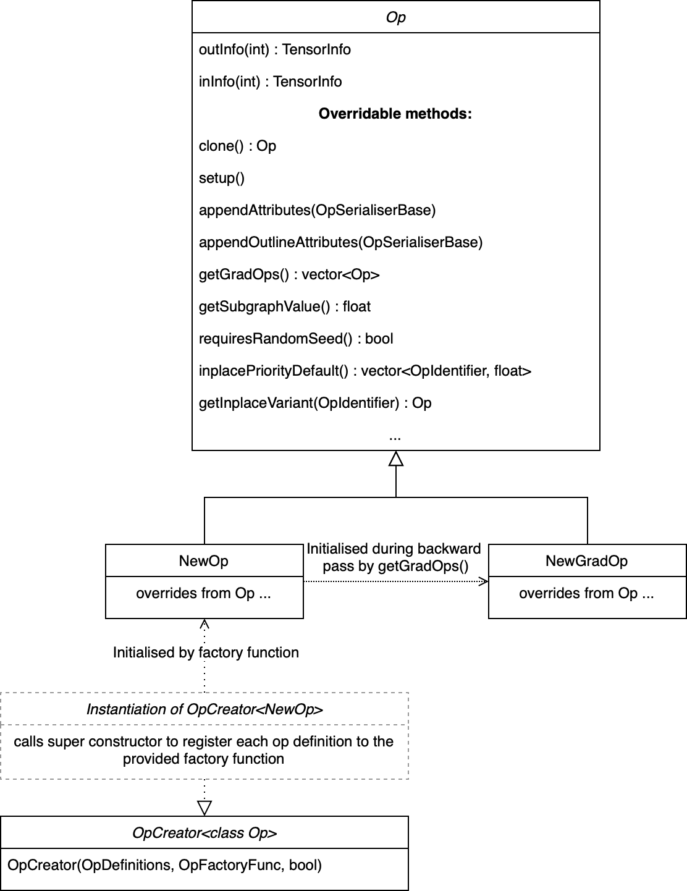
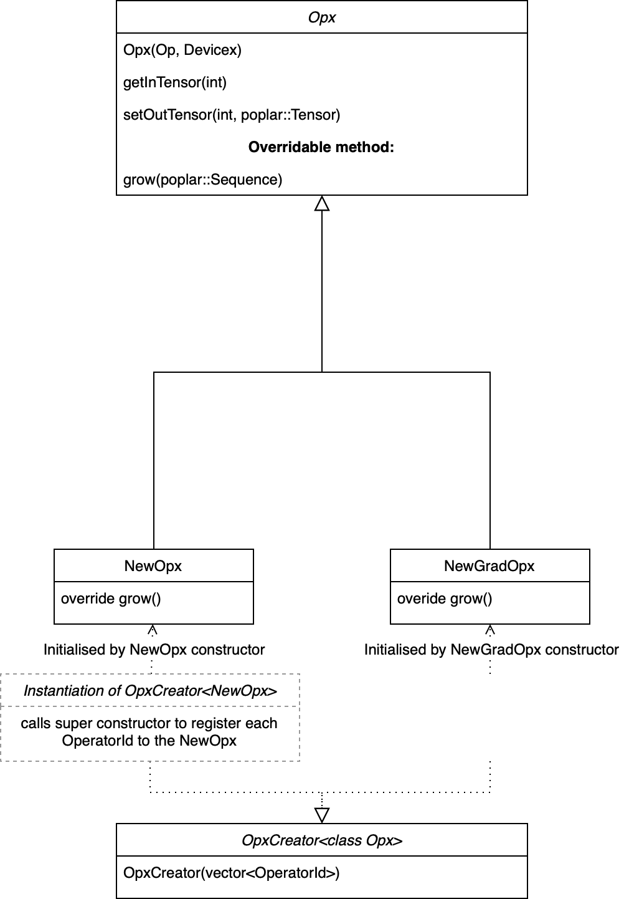

Custom operators
================

This section explains how to implement a custom operator (op) in PopART. Code
from the `Leaky ReLU custom op example
<https://github.com/graphcore/tutorials/tree/sdk-release-2.2/feature_examples/popart/custom_operators/leaky_relu_example>`_
in the Graphcore GitHub repository will be used to illustrate the concepts.

Overview
--------

You need to write some C++ classes to implement the op.

One is an implementations of the op as PopART's intermediate representation
(IR). This is used during PopART's compilation process to transform and optimise
the graph. There is also a Poplar implementation of the op, which provides the
code that is run when the graph is executed. If the op will be used for
training, then you also need gradient versions of these.

These classes are compiled to create a shared object library that can be
linked with a Python program when it is run.

You also need to define an "operator identifier". This consists of a unique
combination of domain, operator name and operator version strings. This
is used to register the custom op classes with PopART so that it can be used.

There are two ways of using the new custom op: from the builder
API or from an ONNX file.

* **Builder API**: You can include the new op with the builder API using the
  domain, op name and op version that match the custom op definition.

* **ONNX file:** You can reference the op from an ONNX file using a
  ``NodeProto`` definition that matches the custom op definition.

The custom op will then be instantiated from the shared object library and
treated like any other op in PopART.

You can also provide an "op definition" when you register the custom op. PopART
will use that to check that the correct inputs, outputs and attributes are
provided, and are of the expected types.

.. TODO: the LeakyRelu example of OpDefinition is just `{}` - do we have an
   example that shows inputs, outputs and attribute types?

Custom op classes
~~~~~~~~~~~~~~~~~

The two key base classes in PopART that define an op are:

- ``Op``: the intermediate representation (IR) of an op in PopART. This
  provides methods that are called during PopART's optimisation passes and
  transformations of the compute graph. This representation of the op is
  decoupled from the Poplar implementation.

- ``Opx``: a Poplar implementation of the op. This is the code that will
  actually be run on the IPU.

If the op is required for training, then a ``GradOp`` and ``GradOpx`` must also
be defined for the gradient operation (see :numref:`fig_custom_op_OpGradOpOp`
and :numref:`fig_custom_op_OpGradOpOpx`).

To make these classes visible to PopART, you must instantiate ``OpCreator`` and
``OpxCreator`` objects. These map from the string identifier of the new op
(for example, "LeakyRelu"; see :numref:`define_op_identifier`) to constructors for
your newly-defined ``Op`` and ``Opx`` C++ classes.

  Op class diagram

  Opx class diagram

These classes are compiled to create a shared object library that can be
dynamically linked into the Python program at runtime, as shown below:

.. code-block:: python

  import ctypes

  ctypes.cdll.LoadLibrary(so_path)

You can see how this is done in the `LeakyReLU example
<https://github.com/graphcore/tutorials/tree/sdk-release-2.2/feature_examples/popart/custom_operators/leaky_relu_example/run_leaky_relu.py#L55>`_.

Implementing a custom op
------------------------

Some of the examples in the GitHub repository have a single C++ file that
defines all of the classes for a custom op. Although this can make it easier to
see everything in one place, it can be more difficult to follow. So, in this
section the main elements of the ``LeakyRelu`` example are extracted with some
more detailed descriptions of each method.

The op class
~~~~~~~~~~~~

The `Op
<https://github.com/graphcore/popart/tree/sdk-release-2.2/willow/include/popart/op.hpp#L92>`_
base class provides the methods necessary for the PopART IR passes and
transformations.

The main methods that you need to override or implement are:

* Attributes should be passed into the constructor and corresponding accessors
  defined.

* ``clone()``: returns a copy of the op. Usually, this means returning a
  ``std::make_unique`` copy of the op. This must be implemented.

* ``setup()``: sets the shape and type of the arguments to the op. This must set
  the type and shape information for all the output `TensorInfo
  <https://docs.graphcore.ai/projects/popart-cpp-api/en/latest/api-cpp.html#_CPPv4N6popart10TensorInfoE>`__
  objects.

* ``appendAttributes()``: appends attributes when serialising the op to a
  stream. This is used for some debugging purposes but also for generating the
  PopART IR hash. This hash is used to determine whether a Poplar cache can be
  reused so it is important that op attributes which may alter the Poplar
  compilation are appended to this stream. If this method is overridden, then it
  must also call the base class method.

* ``appendOutlineAttributes()``: determines which ops are functionally
  equivalent during outlining.

* ``getGradOps()``: returns a vector of ``GradOp`` object for each ``Op`` in
  the forward graph to automatically generate the backward pass. There can be a
  separate grad op for each input (this is usually cleaner to implement)
  or a single grad op that generates gradients for all inputs.

  The mapping from the index of each output tensor of the grad op to the index
  of each input tensor of the non-grad op is configured using the
  ``gradOutToNonGradIn()`` method that should be overridden in the ``GradOp``
  definitions (see below).

* ``getSubgraphValue()``: this is used by outlining algorithm to determine
  whether or not to outline ops. There are high and low bounding values
  retrieved by ``getHighSubgraphValue()`` (for expensive ops such as Conv) or
  ``getLowSubgraphValue()`` (for inexpensive ops such as Relu).

* ``requiresRandomSeed()``: this is set to false by default. This should be
  overridden and set to true if an IPU random seed tensor is required by the op.
  If so it will be connected to ``inTensor(getSeedInIndex())`` by the IR
  process.

* ``inplacePriorityDefault()``: if the op can be replaced by an in-place
  variant of itself, this method should be overridden to return a vector of
  ``<OperatorIdentifier, float>`` tuples in descending order of preference. For
  example, the LeakyReLU implementation for this is:

  .. code-block:: cpp

    return {{Onnx::CustomOperators::LeakyReluInplace, 10}};

* ``getInplaceVariant()``: this is called to instantiate a particular in-place
  variant of the Op with a specified ``OperatorIdentifier`` from the vector
  returned by ``inplacePriorityDefault()``.

LeakyReluOp example
...................

.. code-block:: cpp

  class LeakyReluOp : public popart::Op {
  public:
    LeakyReluOp(const popart::OperatorIdentifier &_opid, float _alpha,
                const popart::Op::Settings &settings_)
        : popart::Op(_opid, settings_), alpha(_alpha) {}

    std::unique_ptr<Op> clone() const final {
      return std::make_unique<LeakyReluOp>(*this);
    }

    void setup() final { outInfo(0) = inInfo(0); }

    void appendAttributes(popart::OpSerialiserBase &os) const override {
      Op::appendAttributes(os);
      os.appendAttribute("alpha", getAlpha());
    }

    void appendOutlineAttributes(popart::OpSerialiserBase &os) const override {
      Op::appendOutlineAttributes(os);
      os.appendAttribute("alpha", getAlpha());
    }

    std::vector<std::unique_ptr<popart::Op>> getGradOps() {
      std::vector<std::unique_ptr<Op>> upops;
      upops.emplace_back(new LeakyReluGradOp(*this));
      return upops;
    }

    float getSubgraphValue() const final { return getHighSubgraphValue(); }

    bool requiresRandomSeed() const override { return false; }

    // Attributes
    float getAlpha() const { return alpha; }

  private:
    float alpha;
  };

The grad op class
~~~~~~~~~~~~~~~~~

.. code-block:: cpp

  class LeakyReluGradOp : public popart::Op {
  public:
    LeakyReluGradOp::LeakyReluGradOp(const LeakyReluOp &fwdOp)
        : popart::Op(CustomGradOperators::LeakyReluGrad_6, fwdOp.settings),
          alpha(fwdOp.getAlpha()) {}

    std::unique_ptr<popart::Op> clone() const final {
      return std::make_unique<LeakyReluGradOp>(*this);
    }
    void setup() final { outInfo(0) = inInfo(0); };

    const std::vector<popart::GradInOutMapper> &gradInputInfo() const {
      static const std::vector<popart::GradInOutMapper> inInfo = {
          {0, 0, popart::GradOpInType::GradOut},
          {1, 0, popart::GradOpInType::In}};
      return inInfo;
    }

    // The Grad Op has 1 output, which is the gradient of the only input
    const std::map<int, int> &gradOutToNonGradIn() const {
      static const std::map<int, int> outInfo = {{0, 0}};
      return outInfo;
    }

    bool requiresRandomSeed() const override { return false; }

    // an estimate of how valuable sub-graph matching will be
    float getSubgraphValue() const final { return getHighSubgraphValue(); }

    float getAlpha() const { return alpha; }

    // Implementation defined below
    void appendAttributes(popart::OpSerialiserBase &os) const override {
      Op::appendAttributes(os);
      os.appendAttribute("alpha", getAlpha());
    }

    // Implementation defined below
    void appendOutlineAttributes(popart::OpSerialiserBase &os) const override {
      Op::appendOutlineAttributes(os);
      os.appendAttribute("alpha", getAlpha());
    }

  private:
    float alpha;
  };

The opx class
~~~~~~~~~~~~~

The `Opx
<https://github.com/graphcore/popart/tree/sdk-release-2.2/willow/include/popart/popx/opx.hpp>`_
class provides a ``grow()`` function that implements the corresponding ``Op``
definition as Poplar or PopLibs calls using the provided ``program::Sequence``.
Since ``OpxCreator`` uses a generic constructor, you should also check that the
``Op`` passed in is of the expected type and matches the ``OperatorIdentifier``.

.. code-block:: cpp

    class LeakyReluOpx : public popart::popx::Opx {
    public:
      LeakyReluOpx(popart::Op *op, popart::popx::Devicex *devicex)
          : popart::popx::Opx(op, devicex) {
        verifyOp<LeakyReluOp>(
            op, {CustomOperators::LeakyRelu_1, CustomOperators::LeakyRelu_6});
      }

      void grow(poplar::program::Sequence &prog) const final {

        auto op = getOp<LeakyReluOp>();

        poplar::Tensor input = getInTensor(0);

        float alpha = op.getAlpha();

        // x < 0.0f ? alpha * x : x
        auto expression = pe::Select(pe::Mul(pe::Const(alpha), pe::_1), pe::_1,
                                     pe::Lt(pe::_1, pe::Const(0.0f)));

        popops::mapInPlace(graph(), expression, {input}, prog,
                           debugContext("LeakyRelu"), poplar::OptionFlags());

        setOutTensor(0, input);
      }
    };

The grad opx class
~~~~~~~~~~~~~~~~~~

.. code-block:: cpp

  class LeakyReluGradOpx : public popart::popx::Opx {
  public:
    LeakyReluGradOpx(popart::Op *op, popart::popx::Devicex *devicex)
        : popart::popx::Opx(op, devicex) {
      verifyOp<LeakyReluGradOp>(op, {CustomGradOperators::LeakyReluGrad_1,
                                      CustomGradOperators::LeakyReluGrad_6});
    }

    void grow(poplar::program::Sequence &prog) const final {

      auto op = getOp<LeakyReluGradOp>();

      poplar::Tensor grad = getInTensor(0);
      poplar::Tensor input = getInTensor(1);

      float alpha = op.getAlpha();

      // (grad * (x < 0.0f ? alpha : 1))
      pe::Mul expression = pe::Mul(pe::Select(pe::Const(alpha), pe::Const(1.0f),
                                              pe::Lt(pe::_2, pe::Const(0.0f))),
                                    pe::_1);

      auto output =
          popops::map(graph(), expression, {grad, input}, prog,
                      debugContext("LeakyReluGrad"), poplar::OptionFlags());

      setOutTensor(0, output);
    }
  };

Making the op available to PopART
---------------------------------

After you have written the classes that implement the op, you will need to make
the op available to PopART. This means defining an op identifier and using the
op creator class to register the op with PopART.

.. _define_op_identifier:

Define the op identifier
~~~~~~~~~~~~~~~~~~~~~~~~

The first step is to define an ``OperatorIdentifier`` with the domain, op name
and op version so that the op can be be found by the ``builder.customOp()`` call
in PopART or by a reference to the op in an ONNX file.

The ``OperatorIdentifier`` is a structure with the components ``domain``,
``opName`` and ``opVersion``.

For example, from `leaky_relu_custom_op.cpp
<https://github.com/graphcore/tutorials/tree/sdk-release-2.2/feature_examples/popart/custom_operators/leaky_relu_example/leaky_relu_custom_op.cpp#L13>`_:

.. code-block:: cpp

  namespace CustomOperators {
    const popart::OperatorIdentifier LeakyRelu_1 = {"ai.onnx", "LeakyRelu", 1};
    const popart::OperatorIdentifier LeakyRelu_6 = {"ai.onnx", "LeakyRelu", 6};
  } // namespace CustomOperators

  namespace CustomGradOperators {
    const popart::OperatorIdentifier LeakyReluGrad_1 = {"ai.onnx", "LeakyReluGrad", 1};
    const popart::OperatorIdentifier LeakyReluGrad_6 = {"ai.onnx", "LeakyReluGrad", 6};
  } // namespace CustomGradOperators

Define the op creator
~~~~~~~~~~~~~~~~~~~~~

The op creator registers the the new Op with PopART.

The ``OperatorIdentifier`` and a factory function that generates the new Op
class are passed to the constructor of ``OpCreator`` to create a mapping. When
your program loads the shared object library, this ``OpCreator`` is instantiated
and registers the new Op.

You can also pass in an ``OpDefinition`` that allows the ``inputs``,
``outputs`` and ``attributes`` to be checked against those provided in the model
implementation.

The ``GradOp`` class will be implicitly created when the overridden method
``getGradOps()`` is called during the backwards pass.

.. code-block:: cpp

  namespace {
  static OpDefinition::DataTypes T = {DataType::FLOAT16, DataType::FLOAT};

  static OpDefinition
      leakyReluOpDef({OpDefinition::Inputs({{"input", T}}),
                      OpDefinition::Outputs({{"output", T}}),
                      OpDefinition::Attributes({{"alpha", {"*"}}})});

  static OpCreator<LeakyReluOp> leakyReluOpCreator(
      popart::OpDefinitions({{Onnx::Operators::LeakyRelu_1, leakyReluOpDef},
                            {Onnx::Operators::LeakyRelu_6, leakyReluOpDef}}),
       {
        float alpha = info.attributes.getAttribute<popart::Attributes::Float>(
            "alpha", 1e-2f);
        // default epsilon is 10**(-2)
        return std::make_unique<LeakyReluOp>(info.opid, alpha, info.settings);
      },
      true);
  } // namespace

Define the opx creator
~~~~~~~~~~~~~~~~~~~~~~

You add the ``Opx`` definitions in a similar to the ``Op``. In this case, a
generic constructor of the Opx is always used of the form ``Opx(Op *op, Devicex
*devicex)``. For example:

.. code-block:: cpp

    static popart::popx::OpxCreator<LeakyReluOpx> LeakyReluOpxCreator(
        {CustomOperators::LeakyRelu_1, CustomOperators::LeakyRelu_6});
    static popart::popx::OpxCreator<LeakyReluGradOpx>
        LeakyReluGradOpxCreator({CustomGradOperators::LeakyReluGrad_1,
                                 CustomGradOperators::LeakyReluGrad_6});

ONNX schema and shape inference
-------------------------------

To enable ONNX to use the op as part of an ONNX model, you must define a
schema for it. This includes inputs, outputs, domain, and versions.

To register
an ``OpSchema``, you can use the macro ``ONNX_OPERATOR_SCHEMA(name)`` and then
append the various functions in the class. See `schema.h
<https://github.com/onnx/onnx/blob/master/onnx/defs/schema.h>`_ for more
examples.

.. code-block:: cpp

    namespace ONNX {

    void LeakyReluShapeInference(InferenceContext &ctx) {
      propagateShapeAndTypeFromFirstInput(ctx);
    }

    static const char LeakyReluDoc[] = "Performs a leaky ReLU operation on the input.";

    ONNX_OPERATOR_SET_SCHEMA_EX(
        LeakyRelu,
        comAcme,
        "com.acme",
        1,
        false,
        OpSchema()
            .SetDoc(LeakyReluDoc)
            .Input(0, "X", "Input tensor", "T")
            .Output(0, "Y", "Output tensor", "T")
            .TypeConstraint(
                "T",
                {"tensor(float)", "tensor(int32)", "tensor(float16)"},
                "Constrain input and output types to signed numeric tensors.")
            .TypeAndShapeInferenceFunction(LeakyReluShapeInference));

    static bool registerOps() {
      auto &d = ONNX_NAMESPACE::OpSchemaRegistry::DomainToVersionRange::Instance();
      d.AddDomainToVersion("com.acme", 1, 1);

      ONNX_NAMESPACE::RegisterSchema(
          GetOpSchema<ONNX_OPERATOR_SET_SCHEMA_CLASS_NAME(comAcme, 1, LeakyRelu)>());

      return true;
    }

    } // namespace ONNX

In the same namespace you can define the shape inference for the op. This allows
ONNX to infer from the shape of the inputs the shape of the outputs. With simple
operations, such as this example, the output shape is the same as the first
input, so you can use the ONNX function ``propagateShapeAndTypeFromFirstInput``
from `shape_inference.h
<https://github.com/onnx/onnx/blob/master/onnx/defs/shape_inference.h>`_.

There
are other methods to use for shape inference in ONNX contained in that
header. For example, numpy-style broadcasting, shape from attributes, and so on.
Defining shape inference is optional, however you may encounter issues with
operations later in your model if ONNX is not able to infer the input shape of
an operation from earlier inputs.

Using the op in a program
-------------------------

The op can be referenced, using the values in the op identifier, in a Python
program using the ``builder``. For example, from `run_leaky_relu.py
<https://github.com/graphcore/tutorials/tree/sdk-release-2.2/feature_examples/popart/custom_operators/leaky_relu_example/run_leaky_relu.py>`_:

.. code-block:: python

  output_tensor = builder.customOp(opName="LeakyRelu",
                                   opVersion=6,
                                   domain="ai.onnx",
                                   inputs=[input_tensor],
                                   attributes={"alpha": alpha})[0]

Or the op can be referenced from an ONNX file using a `NodeProto
<https://github.com/onnx/onnx/blob/master/onnx/onnx.proto#L191>`_
definition that matches the domain, name and version of the op.

.. TODO: Do we have an example of this?
