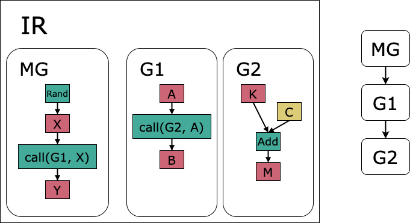

Concepts
^^^^^^^^

Building blocks
""""""""""""""""

.. _fig_popart_ir_building_blocks:
.. figure:: images/popart_ir_building_blocks.png
  :width: 90%
  :align: center
  :alt: `popart.ir` building blocks

  An IR contains a main graph (MG) and multiple other graphs (G). Graphs can contain ops, intermediate tensors (T) and
  constant tensors (C). The main graph can also contain intermediate, constant and variable tensors (V).

The building blocks of ``popart.ir`` are IRs, graphs, tensors and ops. This section summaries these concepts, further information
on each topic can be found later in the user guide.

IRs
***

An IR is an executable program that can be run using a PopART session and a Python process can initialise multiple IRs.
An IR contains one main graph, created on IR initialisation, and multiple other subgraphs that you create.

Graphs
******

.. _fig_popart_ir_calling_a_graph:

  In this example the IR’s main graph (MG) calls subgraph 1 (G1) which in turn calls subgraph 2 (G2).
  This creates a call tree which is depicted on the right.
  Op nodes are green, intermediate tensors are red and constants are yellow.

A graphs describes a computational directed acyclic graph (DAG) which contains two types of nodes:
tensors and ops. There are two types of graphs: the main graph and subgraphs.

* The **main graph** is a special graph and only one exists per IR. It is the entry point of a IR (like the main function in many programming languages). The main graph can contain intermediate, constant and variable tensors.

* **Subgraphs** have input and output tensors. Subgraphs can be called by other graphs using the ``call`` or ``repeat`` op. If a subgraph has multiple call sites, the subgraph is outlined during lowering, leading to code reuse and reduced memory usage. A subgraph can only contain intermediate or constant tensors and not variables. Subgraphs have intermediate tensors which are marked as inputs or outputs. When a subgraph is called the inputs must be provided by the calling graph. The input data can be either be passed by reference or value, and this is determined by the user at the call site.

Tensors
*******

Tensors have a shape and datatype, and sometimes initialisation data.
A tensor will be produced by an op known as the producer and can have multiple consumer ops.
There are three types of tensors: intermediate, variable and constant. Variables and constants are initialised with data.

* **Constants** contain data that cannot change.

* **Variables** contain data that are always live and hence is never freed. Typically model weights are kept on device between runs and are therefore defined as variable tensors.

* **Intermediates** are not initialised with data and are live from the time they are produced until their final consumer.

Ops
******

An op represents an operation in the computational graph and can have input and output tensors.
