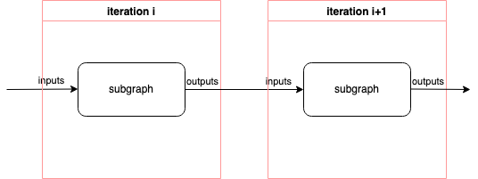

You can create a :ref:`subgraph<subgraph_concept>` in ``popart.ir`` by calling, e.g., ``ir.create_graph("graph")``.
You then connect it with the caller graph using ``ops.call``.
In ``popart.ir``, you have access to ``create_graph`` before you call a graph with
``ops.call``, which gives you the flexibility to manipulate the graph.

Here is a basic example about how to create and call subgraphs.
A subgraph is created and called instead of directly calling the Python function
``increment_fn``.

.. literalinclude:: files/basic_subgraph_popart_ir.py
  :language: python
  :start-after: Op begin
  :end-before: Op end

.. only:: html

    :download:`files/basic_subgraph_popart_ir.py`

Create a subgraph
""""""""""""""""""
You can create a subgraph from a Python function by calling ``ir.create_graph``.
You can use the same Python function to create multiple subgraphs.
For instance, in the following example, two different graphs are created
for different input shapes respectively. The input tensors ``w1`` and ``w2``
have different shapes.

.. literalinclude:: files/create_multi_subgraphs_from_same_func_popart_ir.py
  :language: python
  :start-after: Op begin
  :end-before: Op end

.. only:: html

    :download:`files/create_multi_subgraphs_from_same_func_popart_ir.py`

You can also create the subgraph with an additional graph input with ``pir.subgraph_input``
in its Python function. The ``subgraph_input`` creates a new input tensor for the
subgraph. An example can be found in :ref:`Multi-call of Subgraph Example<multi_call_subgraph_input_example>`.

Call a subgraph
"""""""""""""""
After you have created a subgraph, you can invoke it with an op ``call`` with
the provided input tensors as follows:

.. code-block:: python

  call(subgraph: Graph,
      *subgraph_fn_param_inputs: Union[Tensor, List[Tensor]],
      subgraph_in_to_parent_in: Optional[Mapping[Tensor, Tensor]] = None
      ) -> Union[None, Tensor, Tuple[Tensor, ...]]:

The ``subgraph_fn_param_inputs`` are the inputs the subgraph requires
and they must be in the same order as in the ``create_graph``.
For the subgraph internal tensors that are defined by ``popart.ir.subgraph_input``,
if you are not sure about the order, you can use the ``subgraph_in_to_parent_in``
to provide the mapping between these subgraph tensors to parent graph tensors.

Note that, each subgraph can be called from multiple call sites,
but it is compiled only once to reduce redundant code.

The following example shows a graph being called multiple times with different variables.
In this example, the subgraph was created with an addition graph input ``value``.
When you call this subgraph, you will have to pass a tensor to the subgraph
for this input as well. You can use it to instantiate weights of layers internally.

.. literalinclude:: files/multi_call_subgraph_input_popart_ir.py
  :language: python
  :start-after: Op begin
  :end-before: Op end
  :name: multi_call_subgraph_input_example

.. only:: html

    :download:`files/multi_call_subgraph_input_popart_ir.py`

You can call a graph and get the information about the callsite by using the op ``ops.call_with_info``
instead of ``ops.call``. The ``ops.call_with_info`` returns an ``CallInfo`` object that
provides extra info of the callsite. For instance, you can get the graph being called
using ``called_graph``. The ``get_input_tensors()`` and ``get_output_tensors()`` give the
input tensors and output tensors respectively. You can also obtain the input and output tensor at
a given index using ``get_op_input_tensor(index)`` and ``get_op_output_tensor(index)`` respectively.
You can also find the input subgraph tensor that corresponds to a parent tensor using
``op_in_to_subgraph_in_tensor (parent_tensor)``. The ``subgraph_to_op_tensor(subgraph_tensor)``
provides an input or output tensor in the `called_graph` that associates the input or output tensor
in the parent graph.

With the ``CallInfo`` object, you can use ``set_op_input_modified(subgraph_tensor)`` to specify
that the input `subgraph_tensor` can be modified by this ``call_with_info`` op. This provides
support for inplace variable updates like in this example. After calling the subgraph, the value
of variable tensor ``x`` is changed to 2.

.. literalinclude:: files/call_with_info_popart_ir.py
  :language: python
  :start-after: Op begin
  :end-before: Op end

.. only:: html

    :download:`files/call_with_info_popart_ir.py`

The op ``call_with_info`` is helpful when build and optimize the backward graph,
more details please refer to :ref:`Autodiff<autodiff>`.

Call a subgraph in a loop
"""""""""""""""""""""""""

You can use ``ops.repeat`` to create a loop, see :py:func:`popart-python-api:popart.ir.ops.repeat`.

.. code-block:: python

    repeat(repeat_subgraph: Graph,
           repeat_count: int,
           *subgraph_fn_param_inputs: Union[Tensor, List[Tensor]],
           subgraph_in_to_parent_in: Optional[Mapping[Tensor, Tensor]] = None
           ) -> Union[None, Tensor, Tuple[Tensor, ...]]

It calls a subgraph ``repeat_subgraph`` for ``repeat_count`` number of times.
Its inputs come from two arguments:

 - ``subgraph_fn_param_inputs`` that denotes the inputs passed to the subgraph function and,
 - ``subgraph_in_to_parent_in`` that denotes a mapping from internal tensors in the subgraph being called to tensors at the call site in parent graph.

Both inputs from ``subgraph_fn_param_inputs`` and ``subgraph_in_to_parent_in``
are loop-carried inputs. That is, they are copied into the subgraph as inputs
before the first iteration run. The outputs of each iteration are copied to the
inputs of the next iteration as shown in the diagram below. The outputs of the last
iteration serve as the outputs of this ``repeat`` op.

.. _fig_repeat_op:

The ``repeat`` op requires the subgraph to have:

 - Equal numbers of inputs and outputs;
 - One-to-one mapping of data type and shape between inputs and outputs.

.. note:: This operation requires the repeat count to be greater than 1.

In the example below, the subgraph ``increment_graph`` from ``increment_fn`` is called twice.
The input ``x`` is incremented twice by ``value``. After the first iteration, the outputs
``x + value`` and ``value`` are copied to the inputs for the second iteration.

.. literalinclude:: files/repeat_subgraph_popart_ir_0.py
  :language: python
  :start-after: Op begin
  :end-before: Op end

.. only:: html

    :download:`files/repeat_subgraph_popart_ir_0.py`

Another example below shows how to use the ``subgraph_in_to_parent_in``.
The callable class ``Linear`` defines a linear layer. The subgraph ``linear_graph``
is created from the module ``build`` method.

.. literalinclude:: files/repeat_subgraph_popart_ir_1.py
  :language: python
  :start-after: Op begin
  :end-before: Op end

.. only:: html

    :download:`files/repeat_subgraph_popart_ir_1.py`
