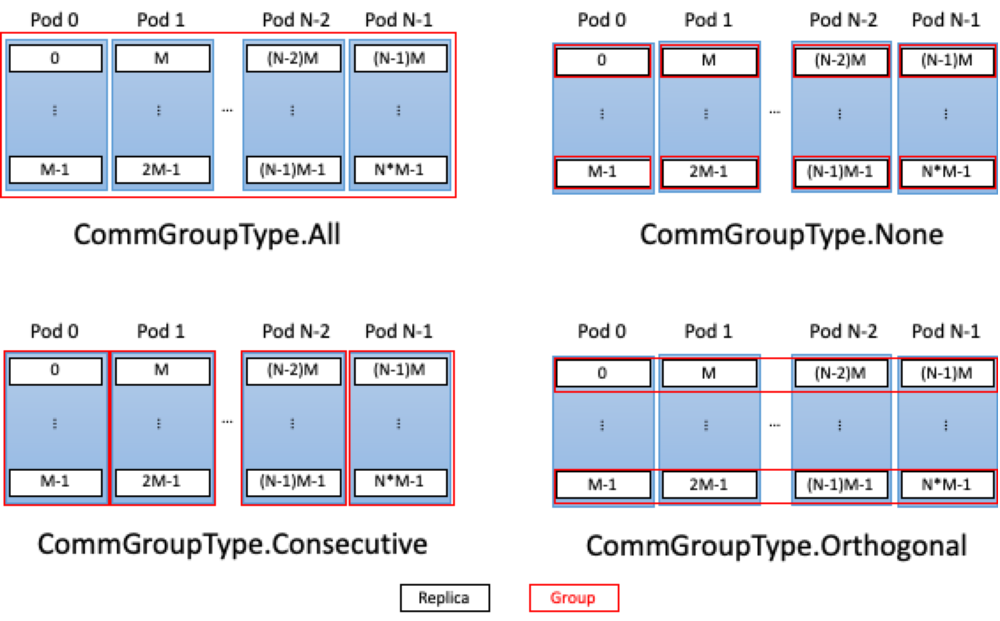

Grouping graph replicas
-----------------------

This section details how to use the :py:class:`popart.VariableSettings` class for
the purpose of grouping tensor weights across replicas.
For a detailed description of what a replica is, refer to the
:ref:`ipu-programmers-guide:replication` section in the :doc:`ipu-programmers-guide:index`.

Concept
~~~~~~~

When using graph replication, variables by default contain the same value on all
replicas. With the help of :py:class:`~popart.VariableSettings`, we can assign
distinct tensor values to and retrieve tensor values from groups of
replicas, removing the limitation of assigning the same value to all replicas.

VariableSettings
~~~~~~~~~~~~~~~~

The :py:class:`~popart.VariableSettings` object is initialized with two values:
a :py:class:`~popart.CommGroup` and a :py:class:`~popart.VariableRetrievalMode`.
:py:class:`~popart.CommGroup` is used to set the communication groups this tensor is divided into across replicas,
and :py:class:`~popart.VariableRetrievalMode` lets you specify how to retrieve variables from the replicas.

The :py:class:`~popart.CommGroup` class is composed of the :py:class:`~popart.CommGroupType` enum,
and the size of each group. Possible values for ``CommGroupType`` are:

* :py:attr:`popart.CommGroupType.All`:
  This is the default group type in which all replicas are considered
  to be a part of one group. This means that all replicas use the same
  variable values. This ``CommGroupType`` ignores group size. An example
  of such a grouping is shown in :numref:`all_consecutive` and in :numref:`fig-commgrouptypes`.

  .. list-table:: Replication factor 16, CommGroupType = All
      :width: 80%
      :widths: 10 40
      :header-rows: 1
      :name: all_consecutive

      * - Group
        - Replicas
      * - 0
        - 0, 1, 2, 3, 4, 5, 6, 7, 8, 9, 10, 11, 12, 13, 14, 15

* :py:attr:`popart.CommGroupType.Consecutive`:
  Adjacent replicas (based on replica index) are grouped together. Each group
  has a size equal to the size ``CommGroup`` is instantiated with. For
  example, for 16 replicas (replica index = 0 to 15) and a group size of 4,
  the groups are assigned as shown in :numref:`varset_consecutive` and in :numref:`fig-commgrouptypes`.

  .. list-table:: Replication factor 16, CommGroupType = Consecutive, CommGroup size = 4
      :width: 80%
      :widths: 10 40
      :header-rows: 1
      :name: varset_consecutive

      * - Group
        - Replicas
      * - 0
        - 0, 1, 2, 3
      * - 1
        - 4, 5, 6, 7
      * - 2
        - 8, 9, 10, 11
      * - 3
        - 12, 13, 14, 15

* :py:attr:`popart.CommGroupType.Orthogonal`:
  Replicas are assigned to groups with a stride defined by the number of groups ``num_groups`` where :math:`num_groups = \frac{number of replicas}{group size}`. For example, for 16 replicas (replica index =
  0 to 15) and a group size of 4, there will be four groups and they are
  assigned as shown in :numref:`varset_orthogonal` and in
  :numref:`fig-commgrouptypes`.

  .. list-table:: Replication factor 16, CommGroupType = Orthogonal, CommGroup size = 4
      :width: 80%
      :widths: 10 40
      :header-rows: 1
      :name: varset_orthogonal

      * - Group
        - Replicas
      * - 0
        - 0, 4, 8, 12
      * - 1
        - 1, 5, 9, 13
      * - 2
        - 2, 6, 10, 14
      * - 3
        - 3, 7, 11, 15

* :py:attr:`popart.CommGroupType.None`:
  Each replica is in its own group. For example, for 16 replicas (replica
  index = 0 to 15), the groups are as shown in :numref:`varset_none` and in :numref:`fig-commgrouptypes`.

  .. list-table:: Replication factor 16,  CommGroupType = None
      :width: 80%
      :widths: 10 40
      :header-rows: 1
      :name: varset_none

      * - Group
        - Replicas
      * - 0
        - 0
      * - 1
        - 1
      * - 2
        - 2
      * - ...
        - ...
      * - 14
        - 14
      * - 15
        - 15

  How replicas across multiple Pods are assigned to groups for the different CommGroupTypes values. There are ``N`` Pods and each has ``M`` replicas. Replicas are numbered sequentially down each first before moving across to the next Pod.

Instantiating variables with VariableSettings
~~~~~~~~~~~~~~~~~~~~~~~~~~~~~~~~~~~~~~~~~~~~~

The number of replicas, the *replication factor*, is needed to create variables with :py:class:`popart.VariableSettings`
because the number of communication groups requiring initialization, and thus
the size of the instantiating buffer, depends on the replication factor.

:py:class:`popart.VariableSettings` can be added to the call to the builder function
:py:func:`~popart.builder._BuilderCore.addInitializedInputTensor` when initiating your variable.

The instantiating buffers used for creating these variables have to be sized such
that they initialize each group individually. This is done by adding an outer
dimension to the instantiating buffer equal to the number of groups, and the
graph builder will handle the rest. For example, a tensor with shape ``[2, 3,
4]`` and a replication factor that results in four groups must be instantiated
with a shape of ``[4, 2, 3, 4]``, where ``[r, ...]`` instantiates the variable on replica ``r``.

Weight input/output
~~~~~~~~~~~~~~~~~~~

When using :py:class:`~popart.PyWeightsIO` to read the value of the weights, the instantiating buffer size must match the size of the initializing data, and if
:py:class:`~popart.VariableRetrievalMode` is
:py:attr:`~popart.VariableRetrievalMode.AllReplicas`, the outer dimension must
match the replication factor.

For example, using :py:class:`~popart.VariableSettings` with a tensor of shape ``[2, 3, 4]``, a replication factor of 4
and :py:class:`~popart.CommGroup` instantiated with :py:attr:`~popart.CommGroupType.Consecutive` and a group size of ``2``, we need a buffer for
:py:class:`~popart.PyWeightsIO` with one of the following shapes:

  * ``[2, 2, 3, 4]`` if we use :py:attr:`popart.VariableRetrievalMode.OnePerGroup`.
  * ``[4, 2, 3, 4]`` if we use :py:attr:`popart.VariableRetrievalMode.AllReplicas`.

The on-device buffer is populated by the session ``readWeights()`` function for :py:func:`training <~popart.TrainingSession.readWeights>` or
for :py:func:`inference <popart.InferenceSession.readWeights>`.

:numref:`var_settings_example_popart_io` shows an example of creating buffers for replicas.

.. literalinclude:: ../user_guide/files/replication_popart.py
    :language: python
    :emphasize-lines: 37-41
    :caption: Creating buffers for replicas.
    :name: var_settings_example_popart_io

ONNX checkpoints
~~~~~~~~~~~~~~~~

ONNX is not, by default, aware of the replication factor.
Therefore, the ONNX model will attempt to interpret the outermost dimension as
a part of each replica. This will usually break the logic of the model.

To address this, the builder function
:py:func:`~popart.builder._BuilderCore.embedReplicationFactor` writes the replication factor
into the ONNX model as an attribute of the graph.

The builder does not need the replication factor embedded when using
``resetHostWeights()`` for :py:func:`training <~popart_core._TrainingSessioncore.resetHostWeights>` or
for :py:func:`inference <popart_core._InferenceSession.resetHostWeights>` to
write an ONNX file into a new model.
